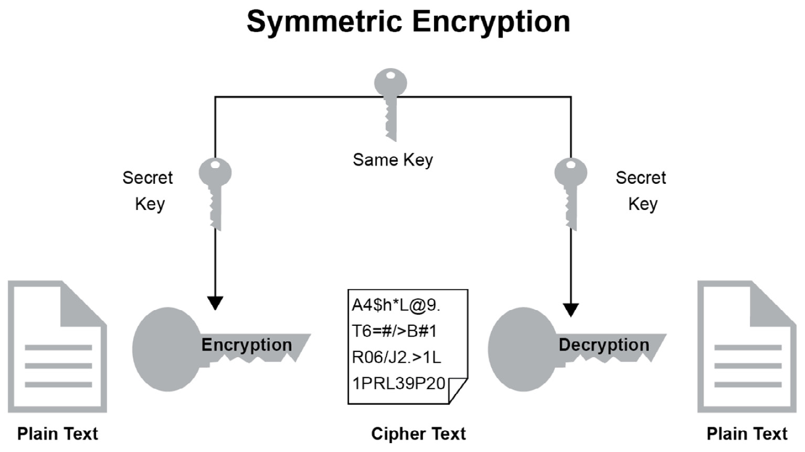
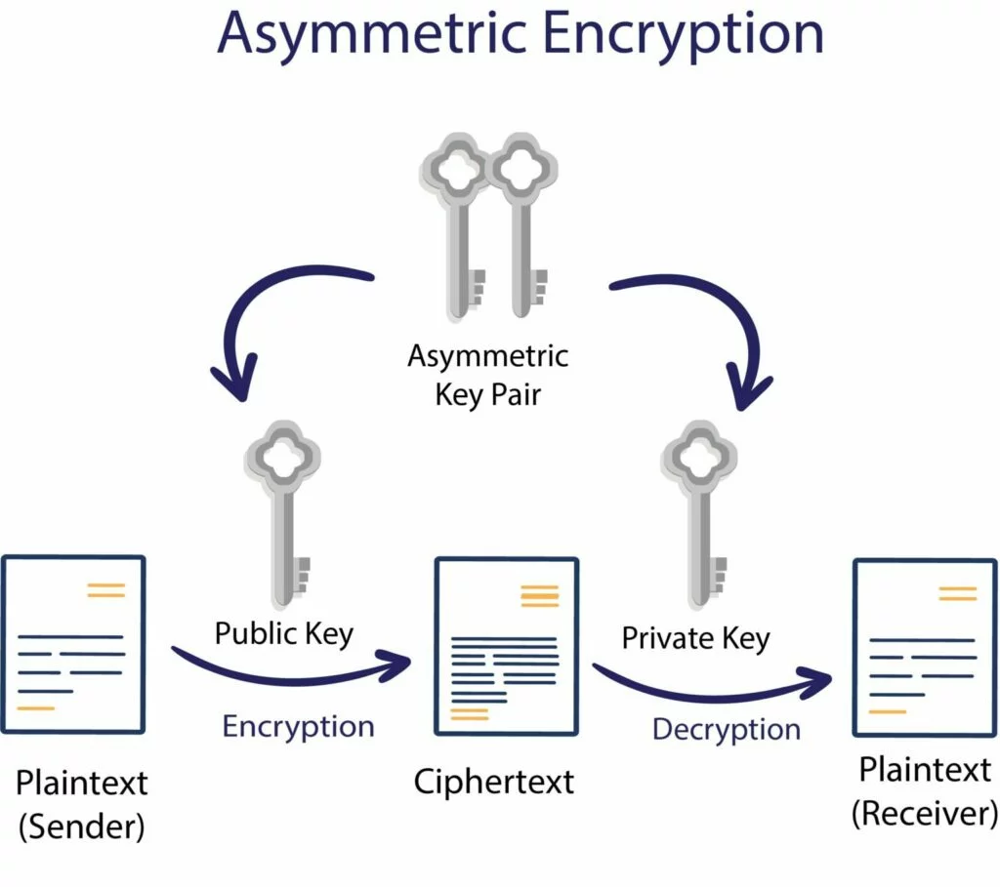

## Intro

Encryption is the method by which information is converted into secret code that hides the information's true meaning. The science of encrypting and decrypting information is called cryptography.

**Unencrypted** data is **plaintext** (could be text, image, document etc)

**Encrypted** data is **ciphertext** (could be text, image, document etc)

**Encryption key** is similar to a password that is used to generate ciphertext

**Algorithm** takes plaintext and an encryption key to create ciphertext. There are many algorithms that do this: AES, Blowfish, RC4 etc

The formulas used to encode and decode messages are called encryption algorithms, or ciphers. Process of encryption takes plaintext and a key and uses an algorithm to generate ciphertext. Decryption is the process of taking ciphertext and key to create plaintext.

## Encryption at rest

Encryption at rest is a type of encryption designed to prevent theft of sensitive data. This type of encryption is usually applied on hard-drives, cloud environment hardware etc. A "secret" is used to encrypt and decrypt the data. The secret is not to be shared with others. Only those that have knowledge of the secret would be able to decrypt the data

Usually with this type of encryption, only a single party is involved that is responsible for encryption and decryption of the data.

## Encryption in transit

In this type of encryption, data is encrypted as it is transferred between two parties. Party A (you) encrypt the data and send it to party B (your bank). Party B decrypts the data, performs some action, encrypts new data and returns this new data back to party A.

This type of encryption involves multiple systems or users.

## Symmetric key encryption

Say you have sender and receiver who want to exchange ciphertext with each other. They do the following:

- Agree on an algorithm (AES-256 for example)
- The sender takes plaintext and a symmetric encryption key and feeds it to AES-256 algorithm
- Algorithm outputs ciphertext
- Ciphertext is then transferred over to receiver
- **The receiver needs to have the same key that was used to encrypt the data!**

How do we transfer the key that was used to encrypt the data?! This is why symmetric encryption is not ideal for encryption in transit. It is better suited for encrypting local data (hard drives, cloud servers etc). But just to complete the example above:

- Receiver decrypts the ciphertext using the encryption key that was used

## Asymmetric key encryption

Say you have sender and receiver who want to exchange ciphertext with each other. They do the following:

- Agree on an algorithm (public-key encryption or digital signatures for example)
- The sender takes plaintext and creates asymmetric keys (notice plural!) for that algorithm. Asymmetric encryption uses 2 keys: a public key and a private key.
- The public key is used to generate the ciphertext and this ciphertext is only decryptable by the private key! Public key cannot decrypt data that it was used to encrypt. The public key is made publicly available
- The sender downloads the public key made available by the receiver. The sender then uses the public key to create ciphertext and transmit it to the receiver
- The receiver already has the private key. Receiver provides the private key and cipher text to the algorithm and is able to read plaintext data.

Notice in the flow above, no sensitive key exchange is required! Public key can be used by anyone to create ciphertext and send it to the receiver. But the receiver is the only person who has the private key and is able to decrypt the data.

This type of encryption is used when two or more parties are involved. This used by SSL or TLS encryption (browser communication) and SSH for example.

Asymmetric encryption is computationally expensive so usually asymmetric encryption is used to exchange symmetric keys and then use symmetric encryption for further communication!
