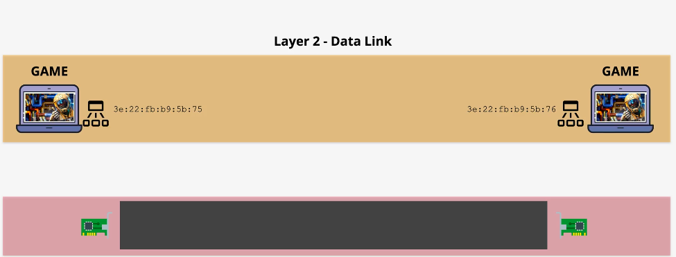
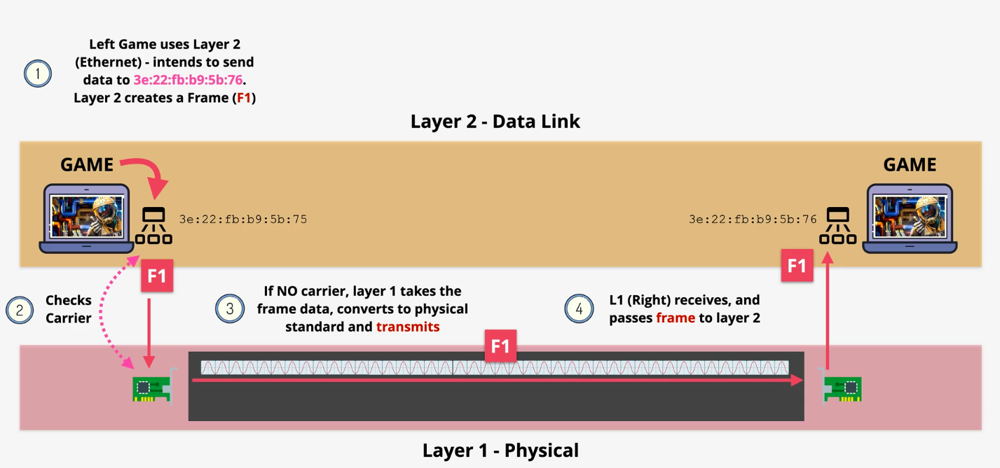
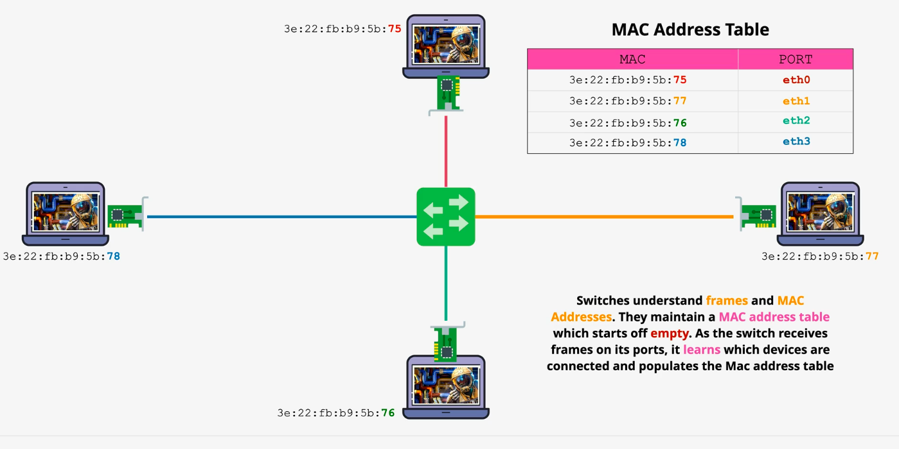
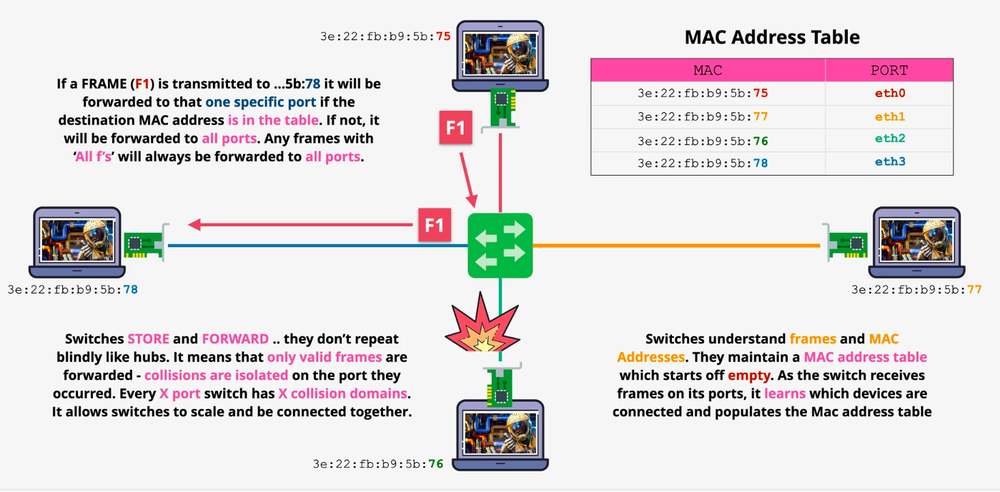
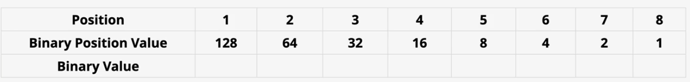
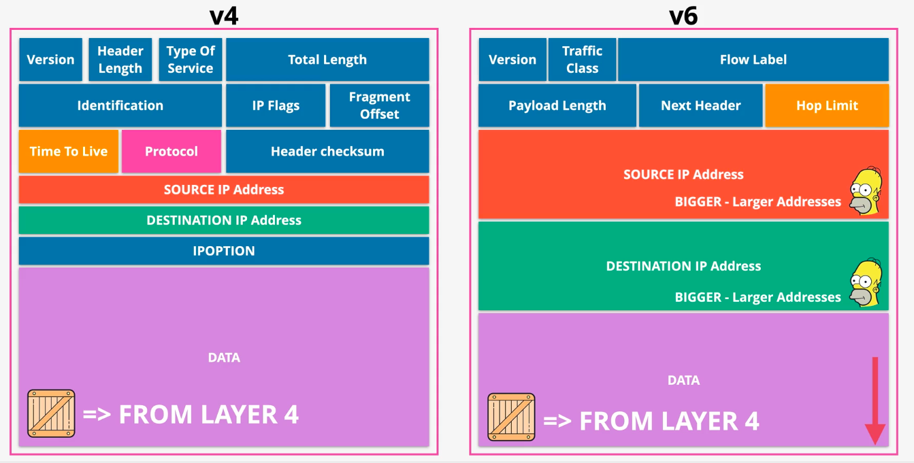

## Intro

We'll look at a few different "types" of networks present.

There's local networking that deals with how data moves between devices on your local network.

There's routing: how data moves from your network to another network (AWS, Netflix etc)

We'll look at how data is actually transmitted from one point to another (segmenting, ports and sessions).

## OSI 7-Layer Model

To understand networks, we'll go through a conceptual model that is a stack of all the components that make networking possible. This model is called the OSI 7-Layer model:

Each "device" capable of communicating with networks (ie connected to the internet!) will have a networking stack. Layers 1, 2 and 3 are called the media layers and the remaining are called host layers. Media layer is responsible for helping data move from point A to point B. Hosts layers are responsible for determining how data is chopped up and re-assembled.

Conceptually, data is sent from layer 7 of once machine (for example your browser), flows all the way down to layer 1 and back up to layer 7 on another machine (youtube server you're watching that video from!).

## Layer 1 - Physical

This layer includes the physical equipment involved in the data transfer, such as the cables and switches. This is also the layer where the data gets converted into a bit stream, which is a string of 1s and 0s. You can think of this as a setup where 2 machines are connected via a cable or WIFI that communicate directly with each other.

At this layer, the two connected machines agree on a standard where a certain voltage means Binary 1 and another means Binary 0. This allows the two connected machines to transmit data between each other.

### Hub

What if we want to add more machines to our system? Not just 2? We can use a layer 1 device called a 4 port hub (to connect 4 machines) to connect 4 machines with each other. The job of a hub is simple: anything received by the hub on any port is transmitted on every other port (including errors and collisions!). See issues here?

- All data is processed by all devices (you can't direct data to a specific port/machine)
- No way to prevent multiple devices from transmitting at once. So if 2 devices transmit at once, it will cause a collision. Also layer 1 cannot detect when a collision occurs. It lacks any intelligence.
- No way to control which devices can transmit data

## Layer 2 - Data Link Layer

We saw the limitations of layer 1 (no device to device communication, no collision avoidance, no transmission control) due to which we need layer 2. Layer 2 requires a functioning layer 1. Assume that for our example, layer 1 is running on ethernet.

Layer 2 sends information over a network using a concept called **frames**.

Devices also have a unique hardware address called a **MAC address** for every device on a network. Addresses look like this: `3e:22:fb:b9:5b:75`. MAC address is attached to a specific piece of hardware.

A MAC address consists of 2 parts, an OUI (organizationally unique identifier) which distinguishes one company from another. The other part is network interface controller (or NIC). This means MAC + NIC should result in a globally unique MAC address.

Keep in mind that layer 1 doesn't understand frames or mac addresses. All it does is that it receives the data from layer 2, transmits it across to another device listening on layer 1, and then the data is moved on up to layer 2 of the receiver.

### Frame

A frame is composed of many parts:

The first part is the preamble and start frame delimiter (SFD). It allows devices to know that this is the start of the frame. Preamble is 56 bits or 7 bytes (8 bits per byte) and SFD is 8 bits or 1 byte. A layer 2 receiver needs to know where the start of a frame is to make sense of the information contained within it.

Next is the destination and source mac addresses. If you want to send to all devices on the local network, you put all Fs for destination aka broadcast. The source MAC address allows the sender to receive replies.

Next is ether type (or type) that helps determine what layer 3 protocol is putting its data inside the frame. That's because layer 3 builds on top of layer 2 and uses layer 2 for device to device communication on a local network. When the receiver receives data, it needs to know the layer 3 protocol that put data into that frame.

Destination MAC address, source MAC address and type are referred to as MAC header

After the header, we have the payload which can range from 46 to 1500 bytes. This contains the data that the frame is sending which is generally provided by layer 3.

At the end there's the frame check sequence that is used to identify any errors in the frame. It allows the destination to check whether any corruption has occurred or not.

### Layer 2 Complete Flow

Let's checkout a complete flow:

[Credit: learn.cantrill.io](learn.cantrill.io)

Say the machine on the left, let's call it L, needs to send data to machine on the right, R. L knows MAC address of R. L interacts with layer 2 software saying that it needs to send data to R via an ethernet. Data to be transmitted is stored in the payload part of the frame. Layer 2 can communicate with layer 1 the networking stack and it can look for the signs of a "carrier" signal. Layer 2 is looking to "sense" a carrier. A carrier signal means that there's already data in the signal and we don't want to corrupt existing data. This is the job of CSMA (carrier sense multiple access). If a carrier isn't detected, the frame is passed on to layer 1. This comes in handy in the scenario where R layer 2 is also trying to send data while L is transmitting. Detection of carrier signal will prompt R to wait until it gets the all clear.

What if there was no carrier detected and both layer 2s transmitted data? Layer 2 contains collision detection. This is the job of collision detection where a jam signal is sent out by all devices that detected a collision. Then a random backoff occurs. This is random as it will allow a device at random to start transmitting again.

Layer 1 doesn't understand what the frame is. It just receives the data from layer 2 and transmits it across. R side receives the data and passes it up to its layer 2. R layer 2 reviews destination mac address of the frame and passes it to R machine.

[Credit: learn.cantrill.io](learn.cantrill.io)

In this approach we've encapsulated data into frames for transmission!

### Switch

Now remember our example from earlier in layer 1 where we had a hub that connected 4 devices? To do the same at layer 2, we use something called a switch! Hub was a layer 1 device and had layer 1 limitations. Switch is a layer 2 device and holds a great advantage over hubs! Let's say we have a machine at 12 O'clock (A) transmitting to machine at 3 O'Clock (B):

Because our devices are layer 2, each machine has its own mac address. Since a switch is a layer 2 device, it understands layer 2 mechanisms. Since each device on our network has a unique address, we need to keep track of those addresses. To do so, our switch keeps track of these addresses using something called a **mac address table (MAT)**. As switches receive traffic, they populate the MAT.

[Credit: learn.cantrill.io](learn.cantrill.io)

Now let's assume that the MAT is populated and A needs to send data to B. It creates the frame and sends it over to the switch via layer 1. Switch sees the frame arrive at the port to which A is connected to. At this point 1 of 2 things will happen:

- If switch didn't know which port the destination MAC address was on, it will forward this frame to all the ports
- If switch does know which port the destination MAC address is attached to, it will use that one port to forward the frame

Switches also do not forward collisions therefore reducing the scope of collisions.

[Credit: learn.cantrill.io](learn.cantrill.io)

## Binary to Decimal

At times, we'll have to convert IPv4 addresses from decimal to binary. Here's an IPv4 address: `133.33.33.7`. Each value between the dot is 8 bytes which means this is a 32 bit number. Converting this to binary should be easy! We'll use this table to perform our conversion:

Let's start from left to right in both the table and with our IPv4 address. So:

- pick 133 and keep going down the table until you find the largest value that's <= 133
- look at the table above and notice that 128 < 133, so put a 1 in that position. Now we're left with 5 (133 - 28 = 5)
- Keep moving down the table until you get to largest number that's <= 5 which is 4. Put a 1 in that position. Now we're left with 1 (5 - 4 = 1)
- Keep going down and put a 1 at position 8.
- All untouched positions will have a 0:

`10000101`

## Layer 3

Layer 3 requires layers 2 and 1. Layer 3's job is to get data from one location (for example a server hosting a video) to another (your laptop). So far we've talked about how machines on the same local area network talk to each other. But what about communication between 2 LANs? Layer 3 is the common protocol that helps communication between multiple layer 2 networks.

Layer 3 adds the internet protocol, or IP, to layer 2. This allows for cross-network (across LANs) IP addressing and routing to move data without direct point-to-point (P2P) links. IP "packets" are moved step by step from source to destination via intermediate networks while encapsulated in different frames along the way.

Devices that move packets across networks are called routers. They remove frame encapsulation and add new frame encapsulation at every hop.

### Packets

Similar to frames, packets encapsulate data that needs to be moved from one machine to another. The difference with packets is that unlike frames, packets can be transferred from destinations not in the same LAN as the source. Packets are placed inside frames where a frame is specific to the local network through which our packet is moving. The frame changes every time packet moves to a new network. The packet remains unchanged (in most cases).

### Packet Structure

Packets can be of 2 types: v4 or v6. For our use-case, we'll focus on a few important fields within a packet (anything not in blue):

- Source/Destination IP address
- Time to live or Hop limit (number of hops before the packet "expires"). This is to prevent infinite forwarding
- Protocol: Layer 4 protocol used (TCP, UDP, ICMP)

Notice for v6, we have a larger address field.
