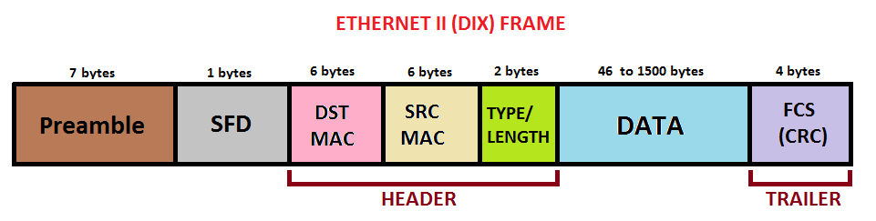

## Intro

We'll look at a few different "types" of networks present.

There's local networking that deals with how data moves between devices on your local network.

There's routing: how data moves from your network to another network (AWS, Netflix etc)

We'll look at how data is actually transmitted from one point to another (segmenting, ports and sessions).

## OSI 7-Layer Model

To understand networks, we'll go through a conceptual model that is a stack of all the components that make networking possible. This model is called the OSI 7-Layer model:

Each "device" capable of communicating with networks (ie connected to the internet!) will have a networking stack. Layers 1, 2 and 3 are called the media layers and the remaining are called host layers. Media layer is responsible for helping data move from point A to point B. Hosts layers are responsible for determining how data is chopped up and re-assembled.

Conceptually, data is sent from layer 7 of once machine (for example your browser), flows all the way down to layer 1 and back up to layer 7 on another machine (youtube server you're watching that video from!).

## Layer 1 - Physical

This layer includes the physical equipment involved in the data transfer, such as the cables and switches. This is also the layer where the data gets converted into a bit stream, which is a string of 1s and 0s. You can think of this as a setup where 2 machines are connected via a cable or WIFI that communicate directly with each other.

At this layer, the two connected machines agree on a standard where a certain voltage means Binary 1 and another means Binary 0. This allows the two connected machines to transmit data between each other.

### Hub

What if we want to add more machines to our system? Not just 2? We can use a 4 port hub (to connect 4 machines) to connect 4 machines with each other. The job of a hub is simple: anything received by the hub on any port is transmitted on every other port (including errors and collisions!). See issues here?

- All data is processed by all devices (you can't direct data to a specific port/machine)
- No way to prevent multiple devices from transmitting at once. So if 2 devices transmit at once, it will cause a collision. Also layer 1 cannot detect when a collision occurs. It lacks any intelligence.
- No way to control which devices can transmit data

## Layer 2 - Data Link Layer

We saw the limitations of layer 1 (no device to device communication, no collision avoidance, no transmission control) due to which we need layer 2. Layer 2 requires a functioning layer 1. Assume that for our example, layer 1 is running on ethernet.

Layer 2 sends information over a network using a concept called **frames**.

Devices also have a unique hardware address called a **MAC address** for every device on a network. Addresses look like this: `3e:22:fb:b9:5b:75`. MAC address is attached to a specific piece of hardware.

A MAC address consists of 2 parts, an OUI (organizationally unique identifier) which distinguishes one company from another. The other part is network interface controller (or NIC). This means MAC + NIC should result in a globally unique MAC address.

Keep in mind that layer 1 doesn't understand frames or mac addresses. All it does is that it receives the data from layer 2, transmits it across to another device listening on layer 1, and then the data is moved on up to layer 2 of the receiver.

### Frame

A frame is composed of many parts:

The first part is the preamble and start frame delimiter (SFD). It allows devices to know that this is the start of the frame. Preamble is 56 bits or 7 bytes (8 bits per byte) and SFD is 8 bits or 1 byte. A layer 2 receiver needs to know where the start of a frame is to make sense of the information contained within it.

Next is the destination and source mac addresses. If you want to send to all devices on the local network, you put all Fs for destination aka broadcast. The source MAC address allows the sender to receive replies.

Next is ether type (or type) that helps determine what layer 3 protocol is putting its data inside the frame. That's because layer 3 builds on top of layer 2 and uses layer 2 for device to device communication on a local network. When the receiver receives data, it needs to know the layer 3 protocol that put data into that frame.

Destination MAC address, source MAC address and type are referred to as MAC header

After the header, we have the payload which can range from 46 to 1500 bytes. This contains the data that the frame is sending which is generally provided by layer 3.

At the end there's the frame check sequence that is used to identify any errors in the frame. It allows the destination to check whether any corruption has occurred or not.
