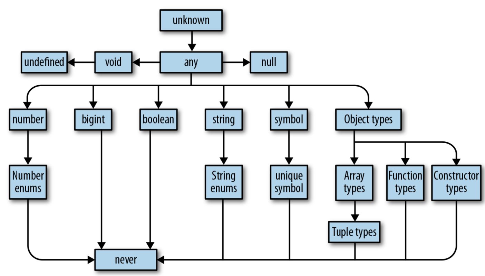

## Intro

Typescript is a strict syntactical superset of JavaScript and adds optional static typing to the language. It is designed for the development of large applications and transpiles to JavaScript.

## Compiler

Let's start at the compiler: programs are files that contain a bunch of text written by you, the programmer. That text is parsed by a special program called a compiler, which trans‐ forms it into an abstract syntax tree (AST), a data structure that ignores things like whitespace, comments, and where you stand on the tabs versus spaces debate. After the TypeScript Compiler generates an AST for your program—but before it emits code—it typechecks your code. The compiler then converts that AST to a lower-level representation called bytecode. You can feed that bytecode into another program called a runtime to evaluate it and get a result. So when you run a program, what you’re really doing is telling the runtime to evaluate the bytecode generated by the compiler from the AST parsed from your source code.

Where TypeScript is special is that instead of compiling straight to bytecode, TS compiles to JavaScript code. You then run that JavaScript code like you normally would—in your browser, or with NodeJS.

This typechecking is the magic behind TypeScript. It’s how TypeScript makes sure that your program works as you expect, that there aren’t obvious mistakes.

## The Type System

To explicitly signal to TypeScript what your types are, use annotations. Annotations take the form value: type and tell the typechecker, “Hey! You see this value here? Its type is type.” Let’s look at a few examples (the comments following each line are the actual types inferred by TypeScript):

```tsx
let a: number = 1; // a is a number
let b: string = 'hello'; // b is a string
let c: boolean[] = [true, false]; // c is an array of booleans
```

And if you want TypeScript to infer your types for you, just leave them off and let TypeScript get to work:

```tsx
let a = 1; // a is a number
let b = 'hello'; // b is a string
let c = [true, false]; // c is an array of booleans
```

TypeScript is a gradually typed language. That means that TypeScript works best when it knows the types of everything in your program at compile time, but it doesn’t have to know every type in order to compile your program. Even in an untyped program, TypeScript can infer some types for you and catch some mistakes, but without knowing the types for everything, it will let a lot of mistakes slip through to your users. TypeScript statically analyzes your code for errors, and shows them to you before you run it.

## tsconfig.json

Every TypeScript project should include a file called `tsconfig.json` in its root directory. This tsconfig.json is where TypeScript projects define things like which files should be compiled, which directory to compile them to, and which version of JavaScript to emit.

```ts
{
  "compilerOptions": {
    //Which APIs should TSC assume exist in the environment you’ll be running your code in? This includes things like ES5’sFunction.prototype.bind, ES2015’sObject.assign, and the DOM’s document.querySelector.
    "lib": ["es2015"],
    // Which module system should TSC compile your code to (CommonJS, SystemJS, ES2015, etc.)?
    "module": "commonjs",
    // Which folder should TSC put your generated JavaScript code in?
    "outDir": "dist",
    "sourceMap": true,
    //Be as strict as possible when checking for invalid code. This option enforces that all of your code is properly typed. We’ll be using it for all of the examples in the book, and you should use it for your TypeScript project too.
    "strict": true,
    //Which JavaScript version should TSC compile your code to (ES3, ES5, ES2015, ES2016, etc.)?
    "target": "es2015"
  },
  //# Which folders should TSC look in to find your TypeScript files?
  "include": ["src"]
}
```

## tslint.json

Your project should also have a `tslint.json` file containing your TSLint configuration, codifying whatever stylistic conventions you want for your code (tabs versus spaces, etc.).

The following command will generate a tslint.json file with a default TSLint configuration:

```bash
./node_modules/.bin/tslint --init
```

You can then add overrides to this to conform with your own coding style. For example, my tslint.json looks like this:

```tsx
{
  "defaultSeverity": "error",
  "extends": [
      "tslint:recommended"
  ],
  "rules": {
    "semicolon": false,
    "trailing-comma": false
  }
}
```

## index.ts

Now that you’ve set up your tsconfig.json and tslint.json, create a src folder containing your first TypeScript file:

```bash
mkdir src
touch src/index.ts
```

Your project’s folder structure should now look this:

```text
    chapter-2/
    ├──node_modules/
    ├──src/
    │ └──index.ts
    ├──package.json
    ├──tsconfig.json
    └──tslint.json
```

Pop open src/index.ts in your code editor, and enter the following TypeScript code:

```tsx
console.log('Hello TypeScript!');
```

Then, compile and run your TypeScript code:

```tsx
# Compile your TypeScript with TSC
./node_modules/.bin/tsc
# Run your code with NodeJS
node ./dist/index.js
```

This will print `Hello Typescript` in your terminal! With `ts-node` installed, you can simply do this:

```bash
ts-node index.ts
```

## Types

Officially a type is set of values and the things you can do with them. For example:

• The boolean type is the set of all booleans (there are just two: true and false)
and the operations you can perform on them (like ||, &&, and !).

• The number type is the set of all numbers and the operations you can perform on them (like +, -, \*, /, %, ||, &&, and ?), including the methods you can call on them like .toFixed, .toPrecision, .toString, and so on.

• The string type is the set of all strings and the operations you can perform on them (like +, ||, and &&), including the methods you can call on them like .concat and .toUpperCase.

When you see that something is of type T, not only do you know that it’s a T, but you also know exactly what you can do with that T (and what you can’t). Remember, the whole point is to use the typechecker to stop you from doing invalid things. And the way the typechecker knows what’s valid and what’s not is by looking at the types you’re using and how you’re using them.

You can also define your own type:

```tsx
type Programmer = {
  /**
   * The full name of the Programmer
   */
  name: string;
  /**
   * This Programmer is known for what?
   */
  knownFor: string[];
};

const ada: Programmer = {
  name: 'Ada Lovelace',
  knownFor: ['Mathematics', 'Computing', 'First Programmer'],
};
```

Comments you see above are docstring comments.

Here's what typescript's type hierarchy looks like:



Say you have a function that takes some value and returns that value multiplied by itself:

```tsx
function squareOf(n) {
  return n * n;
}
// squareOf(2) evaluates to 4
// squareOf('z') evaluates to NaN
```

Clearly, this function will only work for numbers—if you pass anything besides a number to squareOf, the result will be invalid. So what we do is explicitly annotate the parameter’s type:

```tsx
function squareOf(n: number) {
  return n * n;
}
```

We can say the following things about the last code example:

1. squareOf’s parameter n is constrained to number.

2. The type of the value 2 is assignable to (equivalently: compatible with) number.

Without a type annotation, squareOf is unconstrained in its parameter, and you can pass any type of argument to it. Once we constrain it, TypeScript goes to work for us verifying that every place we call our function, we call it with a compatible argument.

### any

any is the Godfather of types. It does anything for a price, but you don’t want to ask any for a favor unless you’re completely out of options. In TypeScript everything needs to have a type at compile time, and any is the default type when you (the pro‐ grammer) and TypeScript (the typechecker) can’t figure out what type something is. It’s a last resort type, and you should avoid it when possible. any is the set of all values, and you can do anything with any. That means that if you have a value of type any you can add to it, multiply by it, call .pizza() on it—anything.

```tsx
let a: any = 666; // any
let b: any = ['danger']; // any
let c = a + b; // any
```

Using any in the above, no errors are thrown! My compiler returned this:

```tsx
666danger
```

### unknown

For the few cases where you have a value whose type you really don’t know ahead of time, don’t use any, and instead reach for unknown. Like any, it represents any value, but TypeScript won’t let you use an unknown type until you refine it by checking what it is. (more on refinement later)

### boolean

```tsx
leta = true;
var b = false;
const c = true;
let d: boolean = true;
let e: true = true;
let f: true = false; // Error TS2322: Type 'false' is not assignable to type 'true'.
```

`e` isn’t just any old boolean—it’s the specific boolean true. By using a value as a type, we essentially limited the possible values for `e` and `f` from all booleans to one specific boolean each. This feature is called **type literals**.

**type literal** : A type that represents a single value and nothing else

### number

number is the set of all numbers: integers, floats, positives, negatives, Infinity, NaN, and so on. Numbers can do, well, numbery things, like addition (+), subtraction (-), modulo (%), and comparison (<).Example:

```tsx
let a = 1234;
var b = Infinity * 0.1;
const c = 5678;
let d = a < b; //bool
let e: number = 100;
let f: 26.218 = 26.218; // 26.218
f = 27; // Type '27' is not assignable to type '26.218'
let g: 26.218 = 10; // Error TS2322: Type '10' is not assignable to type '26.218'.
```

### objects

TypeScript’s object types specify the shapes of objects. If you try this:

```tsx
let a: object = { b: 'x' };
```

you'll get an error saying: `Property 'b' does not exist on type 'object'`. Wait, that’s not very useful! What’s the point of typing something as an object if you can’t do anything with it? `object` is a little narrower than any, but not by much. object doesn’t tell you a lot about the value it describes, just that the value is a JavaScript object (and that it’s not null).

You can do 2 things:

- Leave off the `object`:

```tsx
let a = { b: 'x' };
```

- Explicitly provide type for `b`:

```tsx
let a: { b: string } = {
  b: 'hello!',
};
console.log(a.b);
```

This is called `object literal` syntax. Object literal syntax says, “Here is a thing that has this shape.” The thing might be an object literal, or it might be a class:

```tsx
let a: { firstName: string; lastName: string } = {
  firstName: 'john',
  lastName: 'barrowman',
};
class Person {
  constructor(public firstName: string, public lastName: string) {}
}
a = new Person('matt', 'smith'); // OK
```

`{firstName: string, lastName: string}` describes the shape of an object, and both the object literal and the class instance from the last example satisfy that shape, so TypeScript lets us assign a Person to `a`.

Can you tell TypeScript that something is optional, or that there might be more properties than you planned for? You bet:

```tsx
let a: {
  b: number; // 1
  c?: string; // 2
  [key: number]: boolean; // 3
};
```

`a`:

1. has property `b` that is a number

2. might have a property `c` that is string that is optional. And if `c` exists, it might be undefined

3. might have any number of numeric properties that are booleans. This too is optional

Example:

```tsx
a = { b: 1, c: undefined, 10: true, 20: false, 30: true };
a = { b: 1, c: undefined };
a = { b: 1, c: 'd' };
a = { b: 1, 10: true };
a = { b: 1, 10: true, 20: false };
```

The `[key: T]: U` `([key: number]: boolean)` syntax is called an **index signature**, and this is the way you tell TypeScript that the given object might contain more keys. The way to read it is, “For this object, all keys of type T (`number` in our example) must have values of type U (`boolean` in our example).” Index signatures let you safely add more keys to an object, in addition to any keys that you explicitly declared. What this means is that for `a`, if you have a number on the left, then it must have a boolean assigned:

```tsx
// not ok:
let a: {
  b: number;
  c?: string;
  2: string; // <-- NO!
  [key: number]: boolean;
};
```

Error for above will be: `Property '2' of type 'string' is not assignable to 'number' index type 'boolean'.ts(2411)`

```tsx
// this is ok:
let a: {
  b: number;
  c?: string;
  2: boolean;
  5: boolean;
  [key: number]: boolean;
};

a = { b: 1, c: undefined, 10: true, 20: false, 2: true, 5: false };
```

There is one rule to keep in mind for index signatures: the index signature key’s type, T, must be assignable to either number or string. More on index signatures [here](https://basarat.gitbook.io/typescript/type-system/index-signatures).

Let's look at another index signature example: say you want to make sure that anything that is stored in an object using a string conforms to the structure `{message: string}`. This can be done with the declaration `{ [index:string] : {message: string} }`. This is demonstrated below:

```tsx
let foo: { [index: string]: { message: string } } = {};

/**
 * Must store stuff that conforms to the structure
 */
/** Ok */
foo['a'] = { message: 'some message' };
/** Error: must contain a `message` of type string. You have a typo in `message` */
foo['a'] = { messages: 'some message' };

/**
 * Stuff that is read is also type checked
 */
/** Ok */
foo['a'].message;
/** Error: messages does not exist. You have a typo in `message` */
foo['a'].messages;
```

Also note that you can use any word for the index signature key’s name—it doesn’t have to be key:

```tsx
let airplaneSeatingAssignments: { [seatNumber: string]: string } = {
  '34D': 'Boris Cherny',
  '34E': 'Bill Gates',
};
```

You can also have lists as type. Say for example, I have an object representing different age groups:

```tsx
let ageGroups: {
  [groupName: string]: number[];
} = {};

ageGroups['under18s'] = [17, 16, 15, 14, 13];
```

What you see above is an object literal notation special case: empty object types: `{}`. Every type except null and undefined is assignable to an empty object type, which can make it tricky to use. Try to avoid empty object types when possible! A better way to redo the prev example would be:

```tsx
let ageGroups: {
  [groupName: string]: number[];
} = { under18s: [17, 16, 15, 14, 13] };
```

Other examples to avoid:

```tsx
let danger: {};
danger = {};
danger = { x: 1 };
danger = [];
danger = 2;
```

To summarize, here are the ways to declare objects in TypeScript:

1. They can be anonymous:.

```tsx
greet({ name: 'you', age: 12 });
function greet(person: { name: string; age: number }) {
  return 'Hello ' + person.name;
}
```

2. They can be named by using either an interface:

```tsx
interface Person {
  name: string;
  age: number;
}

const me: Person = {
  name: 'you',
  age: 12,
};

greet(me);

function greet(person: Person) {
  console.log('Hello ' + person.name + "'re: " + person.age);
}
```

3. or a type alias:

```tsx
type Person = {
  name: string;
  age: number;
};

function greet(person: Person) {
  return 'Hello ' + person.name;
}
```

### type aliases

It’s common to want to use the same type more than once and refer to it by a single name. To do so, we can create an "alias": - a name for any type. The syntax for a type alias is:

```tsx
type Point = {
  x: number;
  y: number;
};

function printCoord(pt: Point) {
  console.log("The coordinate's x value is " + pt.x);
  console.log("The coordinate's y value is " + pt.y);
}

printCoord({ x: 100, y: 100 });
```

Type aliases are useful for DRYing up repeated complex types,5 and for making it clear what a variable is used for.

### union and intersection types

If you have two things A and B, the union of those things is their sum (everything in A or B or both), and the intersection is what they have in common (everything in both A and B). TypeScript gives us special type operators to describe unions and intersections of types: `|` for union and `&` for intersection. Since types are a lot like sets, we can think of them in the same way. Let's look at an example:

```tsx
type Cat = { name: string; purrs: boolean; social: boolean };
type Dog = { name: string; wags: boolean; barks: boolean };
type CatAndDog = Cat & Dog;
type CatOrDogOrBoth = Cat | Dog;
```

If something is a CatOrDogOrBoth, what do you know about it? You know that it has a name property that’s a string, and not much else. On the flip side, what can you assign to a CatOrDogOrBoth? Well, a Cat, a Dog, or both:

```tsx
const fourLeggedCat: CatOrDogOrBoth = {
  name: 'cat',
  purrs: true,
  social: false,
};

const fourLeggedDog: CatOrDogOrBoth = {
  name: 'dog',
  wags: true,
  barks: true,
};

const fourLeggedBoth: CatOrDogOrBoth = {
  name: 'catdog',
  wags: true,
  barks: true,
  purrs: true,
  social: false,
};
```

This is worth reiterating: a value with a union type `|` isn’t necessarily one specific member of your union; in fact, it can be both members at once!

On the other hand, what do you know about CatAndDog? Not only does your canine, feline hybrid super-pet have a name, but it can purr, bark, and wag:

```tsx
const kittyRocky: CatAndDog = {
  name: 'kittyRocky',
  purrs: true,
  social: false,
  wags: true,
  barks: true,
};
```

### arrays

Like in JavaScript, TypeScript arrays are special kinds of objects that support things like concatenation, pushing, searching, and slicing. TypeScript supports two syntaxes for arrays: `T[]` and `Array<T>`. They are identical both in meaning and in performance.

```tsx
let a = [1, 2, 3]; // number[]
var b = ['a', 'b']; // string
let c: string[] = ['a']; //string
let d = [1, 'a']; // (number | string)[]
const e = [2, 'b']; // (number | string)[]
let f = ['red'];
f.push('blue');
// Error TS2345: Argument of type 'true' is not
// assignable to parameter of type 'string':
f.push(true);
```

We initialized `f` with the string 'red'. We then pushed 'blue' onto it; 'blue' is a string, so TypeScript let it pass. Then we tried to push true onto the array, but that failed! Why? Because `f` is an array of strings, and true is not a string.

On the other hand, when we initialized `d`, we gave it a number and a string, so TypeScript inferred that it must be an array of type number `|` string. Because each element might be either a number or a string, you have to check which it is before using it. Like with objects, creating arrays with const won’t hint to TypeScript to infer their types more narrowly. That’s why TypeScript inferred both d and e to be arrays of number | string.

`g` below is the special case: when you initialize an empty array, TypeScript doesn’t know what type the array’s elements should be, so it gives you the benefit of the doubt and makes them any. As you manipulate the array and add elements to it, TypeScript starts to piece together your array’s type. Once your array leaves the scope it was defined in (for example, if you declared it in a function, then returned it), TypeScript will assign it a final type that can’t be expanded anymore:

```tsx
let g = []; // any[]
g.push(1); // number[]
g.push('red'); // string []
```

### tuples

Tuples are subtypes of array. They’re a special way to type arrays that have fixed lengths, where the values at each index have specific, known types. Unlike most other types, tuples have to be explicitly typed when you declare them. That’s because the JavaScript syntax is the same for tuples and arrays (both use square brackets), and TypeScript already has rules for inferring array types from square brackets:

```tsx
let a: [number] = [1];
// A tuple of [first name, last name, birth year]
let b: [string, string, number] = ['malcolm', 'gladwell', 1963];

// Error TS2322: Type 'string' is not assignable to type 'number':
b = ['queen', 'elizabeth', 'ii', 1926];
```

Tuples also support rest elements, which you can use to type tuples with minimum lengths:

```tsx
// A list of strings with at least 1 element
let friends: [string, ...string[]] = ['Sara', 'Tali', 'Chloe', 'Claire'];

// A heterogeneous list
let list: [number, boolean, ...string[]] = [1, false, 'a', 'b', 'c'];
```

### null, undefined, void, and never

JavaScript has two values to represent an absence of something: `null` and `undefined`. TypeScript supports both of these as values, and it also has types for them: `null` and `undefined`. They’re both special types, because in TypeScript the only thing of type undefined is the value `undefined`, and the only thing of type null is the value `null`.

`undefined` means that something hasn’t been defined yet.

`null` means an absence of a value (like if you tried to compute a value, but ran into an error along the way).

In addition to `null` and `undefined`, TypeScript also has `void` and `never`. These are really specific, special-purpose types that draw even finer lines between the different kinds of things that don’t exist:

- `void` is the return type of a function that doesn’t explicitly return anything (for example, console.log)
- `never` is the type of a function that never returns at all (like a function that throws an exception, or one that runs forever)

### enums

Enums are a way to enumerate the possible values for a type. They are unordered data structures that map keys to values. Think of them like objects where the keys are fixed at compile time, so TypeScript can check that the given key actually exists when you access it.
