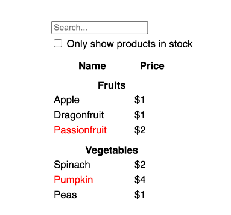
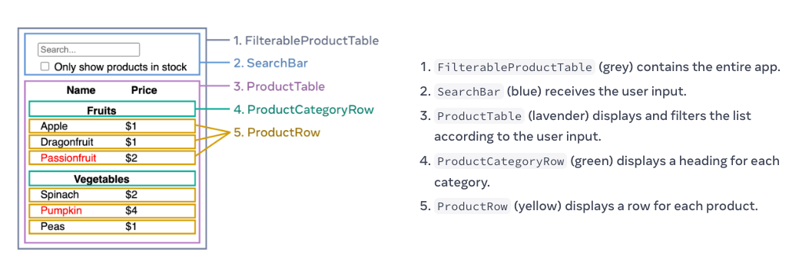

## Component

Let's create our first component:

```tsx
import React from 'react';
import './App.css';

function Button() {
  return <button>alert('You clicked me!')</button>;
}

function App() {
  return (
    <div className="App">
      <p>Learn React</p>
      <Button />
    </div>
  );
}

export default App;
```

A few things to note above:

- We have default component that's exported from this file called `App`
- We have another component called `Button`.

Notice how we use `Button` inside of `App`:

```tsx
<Button />
```

Also notice that the name of this new component needs to start with an upper case. React components are regular JavaScript functions, but their names must start with a capital letter or they won’t work!

## Event Handlers

You can respond to events by declaring event handler functions inside your components:

```tsx
function MyButton() {
  function handleClick() {
    alert('You clicked me!');
  }

  return <button onClick={handleClick}>Click me</button>;
}
```

Notice how `onClick={handleClick}` has no parentheses at the end! Do not call the event handler function: you only need to pass it down. React will call your event handler when the user clicks the button.

## State

Often, you’ll want your component to “remember” some information and display it. For example, maybe you want to count the number of times a button is clicked. To do this, add state to your component.

First, we need to import `useState` from `react`:

```tsx
import React from 'react';
import { useState } from 'react';
import './App.css';
```

Now you can declare a state variable inside your component:

```tsx
const [count, setCount] = useState(0);
```

You will get two things from `useState`: the current state (`count`), and the function that lets you update it (`setCount`). You can give them any names, but the convention is to call them like `[something, setSomething]`.

The first time the button is displayed, count will be 0 because you passed 0 to `useState()`. When you want to change state, call `setCount()` and pass the new value to it. Clicking this button will increment the counter:

```tsx
import React from 'react';
import { useState } from 'react';
import './App.css';

function Button() {
  const [count, setCount] = useState(0);
  function handleClick() {
    setCount(count + 1);
  }
  return <button onClick={handleClick}>'You clicked me: {count} times </button>;
}

function App() {
  return (
    <div className="App">
      <p>Learn React</p>
      <Button />
    </div>
  );
}

export default App;
```

Let's look at the update `Button` component:

```tsx
function Button() {
  const [count, setCount] = useState(0);
  function handleClick() {
    setCount(count + 1);
  }
  return <button onClick={handleClick}>'You clicked me: {count} times </button>;
}
```

- notice the `const` keyword while using the state
- notice there's another function called `handleClick` inside of `Button`.
- notice that we don't do this: `count = count + 1`, we just tell what to do with `count` and let `setCount` do the rest: `setCount(count + 1)`.

You can use the `Button` component as many times as you want and each `Button` will come with its own counter:

```tsx
import { useState } from 'react';
import React from 'react';
import './App.css';

function Button() {
  const [count, setCount] = useState(0);
  function handleClick() {
    setCount(count + 1);
  }

  return <button onClick={handleClick}> You clicked me {count} times! </button>;
}

function App() {
  return (
    <div className="App">
      <p>Learn React</p>
      <Button />
      <Button />
    </div>
  );
}

export default App;
```

Each button “remembers” its own count state and doesn’t affect other buttons.

## Hooks

Functions starting with `use` are called `Hooks`. `useState` is a built-in Hook provided by React. You can find other built-in Hooks in the [React API reference](https://beta.reactjs.org/reference/react). You can also write your own Hooks by combining the existing ones.

Hooks are more restrictive than regular functions. You can only call Hooks at the top level of your components (or other Hooks). If you want to use useState in a condition or a loop, extract a new component and put it there.

In the previous example, each `Button` had its own independent count, and when each button was clicked, only the count for the button clicked changed:


However, often you’ll need components to share data and always update together.

To make both `Button` components display the same count and update together, you need to move the state from the individual buttons “upwards” to the closest component containing all of them. In our example, this closest component is `App`:


Now when you click either button, the count in `App` will change, which will change both of the counts in `Button`. Here’s how you can express this in code.

1. Here is what we had:

```tsx
import { useState } from 'react';
import React from 'react';
import './App.css';

function Button() {
  const [count, setCount] = useState(0);
  function handleClick() {
    setCount(count + 1);
  }

  return <button onClick={handleClick}> You clicked me {count} times! </button>;
}

function App() {
  return (
    <div className="App">
      <p>Learn React</p>
      <Button />
      <Button />
    </div>
  );
}

export default App;
```

2. We need to move the state "up" to `App`:

```tsx
function Button() {
  return <button onClick={handleClick}> You clicked me {count} times! </button>;
}

function App() {
  const [count, setCount] = useState(0);
  function handleClick() {
    setCount(count + 1);
  }

  return (
    <div className="App">
      <p>Learn React</p>
      <Button />
      <Button />
    </div>
  );
}

export default App;
```

3. Next, we need to pass the `count` and `setCount` state variables to the `Button` component. This is done just like how you'd pass a variable to a component. You also need to change the signature for `Button` component to accept `count` and `setCount`. The information you pass down like this is called `props`. `App` component contains the `count` state and the `handleClick` event handler, and passes both of them down as props to each of the buttons.

```tsx
function Button({ count, onClick }: any) {
  return <button onClick={onClick}> You clicked me {count} times! </button>;
}

function App() {
  const [count, setCount] = useState(0);
  function handleClick() {
    setCount(count + 1);
  }

  return (
    <div className="App">
      <p>Learn React</p>
      <Button count={count} onClick={handleClick} />
      <Button count={count} onClick={handleClick} />
    </div>
  );
}

export default App;
```

Let's look at the `Button` component:

```tsx
function Button({ count, onClick }: any) {
  return <button onClick={onClick}> You clicked me {count} times! </button>;
}
```

- it is accepting variables: `{count, onClick}` of type `any`
- the button onClick calls the function passed in which is also called `onClick`.
- value of `count` is displayed as text in the button

From `App`:

```tsx
function App() {
  const [count, setCount] = useState(0);
  function handleClick() {
    setCount(count + 1);
  }

  return (
    <div className="App">
      <p>Learn React</p>
      <Button count={count} onClick={handleClick} />
      <Button count={count} onClick={handleClick} />
    </div>
  );
}
```

- We initialize the state like before using `useState` and declare a `handleClick` function that updates the state
- We call `Button` with the state value and state updater function

When you click the button, the `onClick` handler fires. Each button’s `onClick` prop was set to the `handleClick` function inside `App`, so the code inside of it runs. That code calls `setCount(count + 1)`, incrementing the `count` state variable. The new count value is passed as a prop to each button, so they all show the new value.

This is called “lifting state up”. By moving state up, we’ve shared it between components.

With the above in place, your buttons will both reflect the updated value as you click on any button. I made mine a little fun where we start off from 10 and each click reduces the number. While the number > 0, we're healthy and at 0, we alert happy new year! `App` component stays the same:

```tsx
function Button({ count, onClick }: any) {
  return (
    <button onClick={onClick}>
      Remaining: {count > 0 ? count : '0'} {count > 0 ? 'old year' : 'happy new year!'}
    </button>
  );
}

function App() {
  const [count, setCount] = useState(10);

  function handleClick() {
    setCount(count - 1);
  }

  return (
    <div className="App">
      <p>Learn React</p>
      <Button count={count} onClick={handleClick} />
      <Button count={count} onClick={handleClick} />
    </div>
  );
}
```

## Let's Implement

Let's create this:



There are five components on this screen:



Here's their hierarchy:

- FilterableProductTable

  - SearchBar

  - ProductTable

    - Product Category Row

    - Product Row

Let's assume this is the data that our API has returned:

```tsx
[
  { category: 'Fruits', price: '$1', stocked: true, name: 'Apple' },
  { category: 'Fruits', price: '$1', stocked: true, name: 'Dragonfruit' },
  { category: 'Fruits', price: '$2', stocked: false, name: 'Passionfruit' },
  { category: 'Vegetables', price: '$2', stocked: true, name: 'Spinach' },
  { category: 'Vegetables', price: '$4', stocked: false, name: 'Pumpkin' },
  { category: 'Vegetables', price: '$1', stocked: true, name: 'Peas' },
];
```
