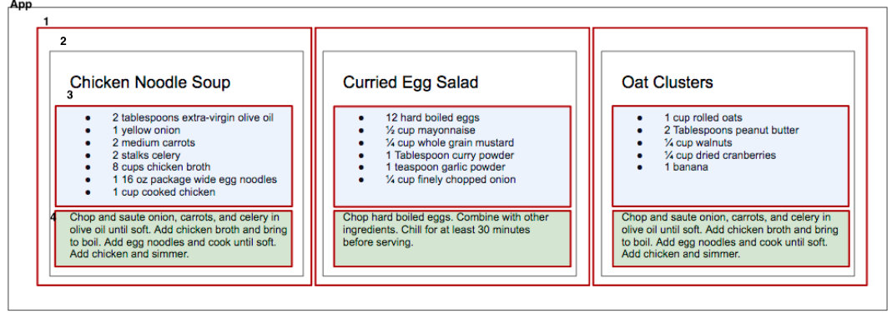
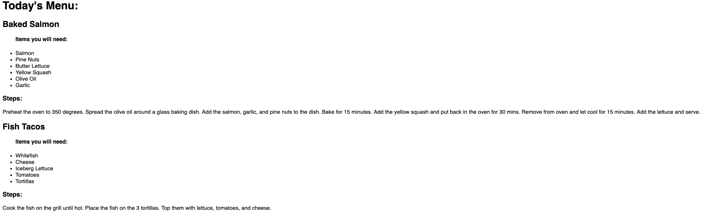
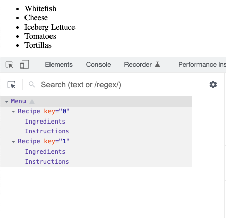
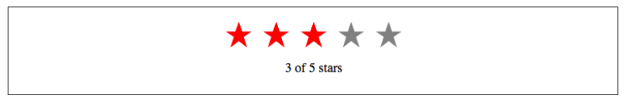
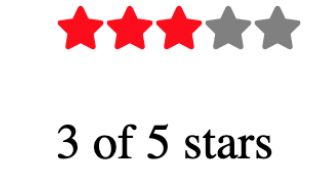

## functions

Any time you want to perform some sort of repeatable task with JavaScript, you can use a function. Let’s take a look at some of the different syntax options:

### function declarations

A function declaration or function definition starts with the `function` keyword, which is followed by the name of the function, `letsPrint`. The JavaScript statements that are part of the function are defined between the curly braces. Once you’ve declared the function, you’ll invoke or call it to see it execute:

```jsx
function letsPrint() {
  console.log('Lets print');
}
letsPrint();
```

Once invoked, you’ll see the message logged to the console.

### function expression

Another option is to use a function expression. This just involves creating the function as a variable:

```jsx
const letsPrint = function () {
  console.log('Lets print');
};
letsPrint();
```

One thing to be aware of when deciding between a function declaration and a function expression is that function declarations are hoisted and function expressions are not: meaning you can invoke a function before you write a function declaration. You cannot invoke a function created by a function expression.

### passing arguments

The `letsPrint` function currently takes in no arguments or parameters. We can pass named parameters to a function by adding them to the parentheses. Let’s start by adding a `firstName` variable:

```tsx
const letsPrint = function (firstName: string) {
  console.log(`Hello ${firstName}`);
};

letsPrint('Billy');
```

Now when we call the `letsPrint` function, the `firstName` value sent will be added to the console message. Notice how we need to provide the "type" for this variable. We could add to this a bit by creating another argument called message. Now, we won’t hard-code the message. We’ll pass in a dynamic value as a parameter:

```tsx
const letsPrint = function (firstName: string, message: string) {
  console.log(`${message} ${firstName}`);
};

letsPrint('Billy', 'Hello!');
```

### function returns

Let's have our function return stuff:

```tsx
const letsPrint = function (firstName: string, message: string): string {
  return `${message} ${firstName}`;
};

console.log(letsPrint('Billy', 'Hello!'));
```

Notice the return type for this function:

```tsx
 function (...): string
```

### arrow functions

Arrow functions are a useful new feature of ES6. With arrow functions, you can create functions without using the function keyword. You also often do not have to use the return keyword. Let’s consider a function that takes in a firstName and returns a string, turning the person into a soccer fan:

```tsx
const makeSoccerFan = (name: string) => `${name} is a soccer fan!`;
```

With the arrow, we now have an entire function declaration on one line. The `function` keyword is removed. We also remove return because the arrow points to what should be returned. We can keep this as a one-line function because there is only one statement that needs to be returned. If there are multiple lines, you’ll use curly braces. Also, you can provide the return type from that function: `const myFunc = (.....): string => {`

```tsx
const myFunc = (name: string): string => {
  if (name) {
    return `${name} is a soccer fan!`;
  } else {
    return 'Not a soccer fan!';
  }
};
```

### returning objects

What happens if you want to return an object? Consider a function called person that builds an object based on parameters passed in for `firstName` and `lastName`:

```tsx
// Declared type person
type Person = {
  firstName: string;
  lastName: string;
};

// ? means it is optional
const getInfo = (firstName?: string, lastName?: string): Person => {
  if (firstName && lastName) {
    return {
      firstName: firstName,
      lastName: lastName,
    };
  } else {
    return {
      firstName: 'N/A',
      lastName: 'N/A',
    };
  }
};

console.log(JSON.stringify(getInfo('James', 'Bond')));
```

## objects and arrays

Since ES2016, JavaScript syntax has supported creative ways of scoping variables within objects and arrays. These creative techniques are widely used among the React community. Let’s take a look at a few of them, including destructuring, object literal enhancement, and the spread operator.

### destructuring objects

Destructuring means picking and choosing only those fields that are of interest to you from an object. Say for example, we're passed an object of type `Person` with a person's `firstName`, `lastName` and `age` but we only want to display their `firstName` and `age`:

```tsx
type Person = {
  firstName: string;
  lastName: string;
  age: number;
};

const getInfo = ({ firstName, age }: Person) => {
  console.log(`You sent in: ${firstName}, ${age}`);
};

const myPerson: Person = {
  firstName: 'james',
  lastName: 'bond',
  age: 40,
};

getInfo(myPerson);
```

A new notation above:

- Typescript expects us to define the types we're extracting from the object. Thus this line:

```tsx
({ firstName, age }: Person)
```

Let’s take this one level farther to reflect a data change. Now, the regularPerson object has a new nested object on the spouse key. So our new `Person` object is now this:

```tsx
type Person = {
  firstName: string;
  lastName: string;
  age: number;
  spouse: {
    firstName: string;
    lastName: string;
  };
};

const getInfo = ({ lastName, age, spouse: { firstName } }: Person) => {
  console.log(
    `Welcome Mr. ${lastName}, 
    aged ${age} and your wife: 
    ${firstName}`
  );
};

const myPerson: Person = {
  firstName: 'james',
  lastName: 'bond',
  age: 40,
  spouse: {
    firstName: 'eva',
    lastName: 'green',
  },
};

getInfo(myPerson);
```

### destructuring arrays

Values can also be destructured from arrays. Imagine that we wanted to assign the first value of an array to a variable name:

```tsx
const [a] = ['a', 'b', 'c'];
console.log(a); // a
```

We can also pass over unnecessary values with list matching using commas. List matching occurs when commas take the place of elements that should be skipped. With the same array, we can access the last value by replacing the first two values with commas:

```tsx
const [, , c] = ['a', 'b', 'c'];
console.log(c); // c
```

### object literal enhancement

This is the opposite of destructuring: ie reconstructing the object:

```tsx
const fName = 'james';
const lName = 'bond';
const print = function () {
  console.log(`${this.fName}, ${this.lName}`);
};

const actionHero = { fName, lName, print };
actionHero.print();
```

Notice we use `this` to access the object keys.

Object literal enhancement allows us to pull global variables into objects and reduces typing by making the function keyword unnecessary.

### spread operator

The spread operator is three dots `(...)` that perform several different tasks. First, the spread operator allows us to combine the contents of arrays. For example, if we had two arrays, we could make a third array that combines the two arrays into one:

```tsx
const one = ['a', 'b', 'c'];
const two = ['d', 'e', 'f'];
const three = [...one, ...two];
```

We can also use the three-dot syntax to collect function arguments as an array. When used in a function, these are called rest parameters. Here, we build a function that takes in `n` number of arguments using the spread operator, then uses those arguments to print some console messages:

```tsx
function directions(...args) {
  let [start, ...remaining] = args;
  let [finish, ...stops] = remaining.reverse();

  console.log(`drive through ${args.length} towns`);
  console.log(`start in ${start}`);
  console.log(`the destination is ${finish}`);
  console.log(`stopping ${stops.length} times in between`);
}

directions('Truckee', 'Tahoe City', 'Sunnyside', 'Homewood', 'Tahoma');
```

The directions function takes in the arguments using the spread operator. The first argument is assigned to the `start` variable. The last argument is assigned to a `finish` variable using `Array.reverse`. We then use the length of the arguments array to display how many towns we’re going through. The number of stops is the length of the arguments array minus the finish stop.

The spread operator can also be used for objects:

```tsx
const morning = {
  breakfast: 'oatmeal',
  lunch: 'peanut butter and jelly',
};
const dinner = 'mac and cheese';
const backpackingMeals = { ...morning, dinner };
console.log(backpackingMeals);
// {
// breakfast: "oatmeal",
// lunch: "peanut butter and jelly",
// dinner: "mac and cheese"
// }
```

More on `spread` operator [here](https://developer.mozilla.org/en-US/docs/Web/JavaScript/Reference/Operators/Spread_syntax).

## asynchronous execution

So far, we've seen synchronous execution. Let's see how we can make async calls:

### fetch and promise

```tsx
import fetch from 'cross-fetch';
console.log(fetch('https://api.randomuser.me/?nat=US&results=1'));
```

We're fetching a response from an API using the `fetch` library.

Running the above returns: `Promise { <pending> }`. What does that mean?! The promise is an object that represents whether the async operation is pending, has been completed, or has failed. The pending promise represents a state before the data has been fetched. We need to chain on a function called `.then()`. This function will take in a callback function that will run if the previous operation was successful. The `then` method will invoke the callback function once the promise has resolved. In other words, fetch some data, "then" convert response to JSON:

```tsx
import fetch from 'cross-fetch';

fetch('//api.github.com/users/lquixada')
  .then((res) => {
    if (res.status >= 400) {
      throw new Error('Bad response from server');
    }
    return res.json();
  })
  .then((user) => {
    console.log(user);
  })
  .catch((err) => {
    console.error(err);
  });
```

You see this gets ugly! Too many `.then()` calls.

### async and await

Using `async` and `await` is preferred because it looks more familiar, like code that’s found in a synchronous function. Instead of waiting for the results of a promise to resolve and handling it with a chain of `then` functions, `async` functions can be told to wait for the promise to resolve before further executing any code found in the function.
Let’s make another API request but wrap the functionality with an async function:

```tsx
// async function
const getInfo = async () => {
  try {
    //await the result
    const res = await fetch('//api.github.com/users/lquixada');

    if (res.status >= 400) {
      throw new Error('Bad response from server');
    }

    const user = await res.json();

    console.log(user);
  } catch (err) {
    console.error(err);
  }
};

getInfo();
```

Notice that the getFakePerson function is declared using the async keyword. This makes it an asynchronous function that can wait for promises to resolve before executing the code any further. The `await` keyword is used before promise calls. This tells the function to wait for the promise to resolve.

## imperative vs declarative

Functional programming is a part of a larger programming paradigm: `declarative programming`. Declarative programming is a style of programming where applications are structured in a way that prioritizes **describing what should happen** over defining how it should happen.

Contrast that with imperative programming which is a style of programming that’s only concerned with how to achieve results with code. Let's start with the imperative approach (one you're comfortable with!):

First, let’s examine an imperative approach to this task. Ane example that replaces white spaces with a hyphen:

```tsx
const string = 'You are great';
const urlFriendly = '';
for (var i = 0; i < string.length; i++) {
  if (string[i] === ' ') {
    urlFriendly += '-';
  } else {
    urlFriendly += string[i];
  }
}
console.log(urlFriendly); // "You-are-great"
```

Here's declarative approach for the same:

```tsx
const string = 'You are great';
const urlFriendly = string.replace(/ /g, '-');
console.log(urlFriendly);
```

Using `string.replace` is a way of describing what’s supposed to happen: spaces in the string should be replaced. The details of how spaces are dealt with are abstracted away inside the replace function. In a declarative program, the syntax itself describes what should happen, and the details of how things happen are abstracted away. Declarative programs are easy to reason about because the code itself describes what is happening.

Now, let’s consider the task of building a document object model, or `DOM`. An imperative approach would be concerned with how the `DOM` is constructed:

```tsx
const target = document.getElementById('target');
const wrapper = document.createElement('div');
const headline = document.createElement('h1');
wrapper.id = 'welcome';
headline.innerText = 'Hello World';
wrapper.appendChild(headline);
target.appendChild(wrapper);
```

This code is concerned with creating elements, setting elements, and adding them to the document. It would be very hard to make changes, add features, or scale 10,000 lines of code where the `DOM` is constructed imperatively.
Now let’s take a look at how we can construct a DOM declaratively using a React component:

```tsx
const { render } = ReactDOM;
const Welcome = () => (
  <div id="welcome">
    <h1>Hello World</h1>
  </div>
);
render(<Welcome />, document.getElementById('target'));
```

React is declarative. Here, the `Welcome` component describes the `DOM` that should be rendered. The render function uses the instructions declared in the component to build the `DOM`, abstracting away the details of how the `DOM` is to be rendered. We can clearly see that we want to render our `Welcome` component into the element with the ID of `target`.

## React

React is a library that’s designed to update the browser DOM for us. We no longer have to be concerned with the complexities associated with building high-performing SPAs because React can do that for us. With React, we do not interact with the DOM API directly. Instead, we provide instructions for what we want React to build, and React will take care of rendering and reconciling the elements we’ve instructed it to create. React elements are the instructions for how the browser DOM should be created.

### react DOM

Once we’ve created a React element, we’ll want to see it in the browser. ReactDOM contains the tools necessary to render React elements in the browser. `ReactDOM` is where we’ll find the render method.
We can render a React element, including its children, to the DOM with `ReactDOM.render`. The element we want to render is passed as the first argument, and the second argument is the target node, where we should render the element.

The `dish` element below has 3 arguments:

```tsx
const dish = React.createElement('h1', 'id-0', 'Baked Salmon');
const root = ReactDOM.createRoot(document.getElementById('root') as HTMLElement);
root.render([dish, dessert]);
```

- The first argument, `h1` defines the type of element we want to create. In this case, we want to create an h1 element.

- The second argument, `id-0`, represents the element’s properties. This h1 currently has an id of `id-0`.

- The third argument,`Baked Salmon`, represents the element’s children: ie any nodes that are inserted between the opening and closing tag (in this case, just some text).

We build this div inside the body tag:

```tsx
<body>
  <div id="root">
    <h1 id="id-0">Baked Salmon</h1>{' '}
  </div>
</body>
```

You can also render multiple elements:

```tsx
const dish = React.createElement('h1', null, 'Baked Salmon');
const dessert = React.createElement('h2', null, 'Coconut Cream Pie');

const root = ReactDOM.createRoot(document.getElementById('root') as HTMLElement);
root.render([dish, dessert]);
```

## react rendering

Let’s consider an unordered list that contains ingredients:

```tsx
<ul>
  <li>2 lb salmon</li>
  <li>5 sprigs fresh rosemary</li>
  <li>2 tablespoons olive oil</li>
  <li>2 small lemons</li>
  <li>1 teaspoon kosher salt</li> <li>4 cloves of chopped garlic</li>
</ul>
```

Here, the unordered list, `ul` is the root element, and it has six children (`li`). We can represent this `ul` and its children with `React.createElement`:

```tsx
const myElement = React.createElement(
  'ul',
  null,
  React.createElement('li', null, '2 lb salmon'),
  React.createElement('li', null, '5 sprigs fresh rosemary'),
  React.createElement('li', null, '2 tablespoons olive oil'),
  React.createElement('li', null, '2 small lemons'),
  React.createElement('li', null, '1 teaspoon kosher salt'),
  React.createElement('li', null, '4 cloves of chopped garlic')
);

const root = ReactDOM.createRoot(document.getElementById('root') as HTMLElement);
root.render(myElement);
```

Notice that `li` tags are now the children of `ul`.

If we were to inspect the resulting React element, we would see each list item represented by a React element and added to an array called `props.children`. If you console log this element, you'll see this:

```txt
{
  "type": "ul",
  "props": {
  "children": [
  { "type": "li", "props": { "children": "2 lb salmon" } ... },
  { "type": "li", "props": { "children": "5 sprigs fresh rosemary"} ... },
  { "type": "li", "props": { "children": "2 tablespoons olive oil" } ... },
  { "type": "li", "props": { "children": "2 small lemons"} ... },
  { "type": "li", "props": { "children": "1 teaspoon kosher salt"} ... },
  { "type": "li", "props": { "children": "4 cloves of chopped garlic"} ... }
  ]
}
```

The major advantage of using React is its ability to separate data from UI elements. Since React is just JavaScript, we can add JavaScript logic to help us build the React component tree. For example, ingredients can be stored in an array, and we can map that array to the React elements.
Let’s go back and think about the unordered list for a moment:

```tsx
React.createElement(
  'ul',
  null,
  React.createElement('li', null, '2 lb salmon'),
  React.createElement('li', null, '5 sprigs fresh rosemary'),
  React.createElement('li', null, '2 tablespoons olive oil'),
  React.createElement('li', null, '2 small lemons'),
  React.createElement('li', null, '1 teaspoon kosher salt'),
  React.createElement('li', null, '4 cloves of chopped garlic')
);
```

The data used in list of ingredients above can easily be represented using a JavaScript array:

```tsx
const items = [
  '2 lb salmon',
  '5 sprigs fresh rosemary',
  '2 tablespoons olive oil',
  '2 small lemons',
  '1 teaspoon kosher salt',
  '4 cloves of chopped garlic',
];
```

We want to use this data to generate the correct number of list items without having to hard-code each one. We can map over the array and create list items for as many ingredients as there are:

```tsx
const items = [
  '2 lb salmon',
  '5 sprigs fresh rosemary',
  '2 tablespoons olive oil',
  '2 small lemons',
  '1 teaspoon kosher salt',
  '4 cloves of chopped garlic',
];

const finalList = React.createElement(
  'ul',
  null,
  items.map((item) => React.createElement('li', null, item))
);

const root = ReactDOM.createRoot(document.getElementById('root') as HTMLElement);
root.render(finalList);
```

This syntax creates a React element for each ingredient in the array. Each string is displayed in the list item’s children as text. The value for each ingredient is displayed as the list item. When running this code, you’ll see a console warning like:

```tsx
react.development.js:207 Warning: Each child in a list should have a unique "key" prop.
Check the top-level render call using <ul>. See https://reactjs.org/link/warning-keys for more information.
at li
```

When we build a list of child elements by iterating through an array, React recommends each of those elements to have a key property. The `key` property is used by React to help it update the `DOM` efficiently. You can make this warning go away by adding a unique key property to each of the list item elements. You can use the array index for each ingredient as that unique value:

```tsx
const items = [
  '2 lb salmon',
  '5 sprigs fresh rosemary',
  '2 tablespoons olive oil',
  '2 small lemons',
  '1 teaspoon kosher salt',
  '4 cloves of chopped garlic',
];

const finalList = React.createElement(
  'ul',
  null,
  items.map((item) => React.createElement('li', { key: i }, item))
);

const root = ReactDOM.createRoot(document.getElementById('root') as HTMLElement);
root.render(finalList);
```

`i` is auto incremented as we loop through the array thus providing a unique key for each `li` item.

## jsx

In the previous section we used `React.createElement()` quite a lot! It is not a recommended approach. The only reason we talked about it was to understand what's going on behind the scenes. Instead, we should be using `jsx` syntax:

```tsx
const element = <h1>Hello, world!</h1>;
```

It is called `JSX`, and it is a syntax extension to JavaScript. We use it with React to describe what the UI should look like. It comes with the full power of JavaScript. React embraces the fact that rendering logic is inherently coupled with other UI logic: how events are handled, how the state changes over time, and how the data is prepared for display.

Instead of artificially separating technologies by putting markup and logic in separate files, React separates concerns with loosely coupled units called [components](#components) that contain both.

React doesn’t require using JSX, but most people find it helpful as a visual aid when working with UI inside the JavaScript code. It also allows React to show more useful error and warning messages.

Converting the previous example to `JSX`, you get this:

```tsx
const items = [
  '2 lb salmon',
  '5 sprigs fresh rosemary',
  '2 tablespoons olive oil',
  '2 small lemons',
  '1 teaspoon kosher salt',
  '4 cloves of chopped garlic',
];
//old
/**const finalList = React.createElement(
  'ul',
  null,
  items.map((item) => React.createElement('li', { key: i }, item))
);*/

const listItems = items.map((item, i) => <li key={i}>{item}</li>);
const finalList = <ul>{listItems}</ul>;

const root = ReactDOM.createRoot(document.getElementById('root') as HTMLElement);
root.render(finalList);
```

We've created a new `listItems` variable:

```tsx
const listItems = items.map((item, i) => <li key={i}>{item}</li>);
```

that maps each array item to a `li` tag (with a unique key of-course!);

Next, we then created our final variable that will be rendered called `finalList` that creates an `ul` out of the `li`:

```tsx
const finalList = <ul>{listItems}</ul>;
```

Notice how `JSX` allows us to add HTML to JavaScript!

## components

When considering a user interface you want to build with React, we break down elements into reusable pieces. For example, the recipes in figure below have a title, ingredients list, and instructions. All are part of a larger recipe or app component. These reusable pieces are called `components` We could create a component for each of the highlighted parts: ingredients, instructions, and so on:



This is a scalable solution! If we want to display one recipe or 10,000, our component structure will support this. The diagram above is labelled with the components that can be used:

- `1`: The menu component called `Menu` that will hold our 2 recipes!
- `2`: A container that will display the title of the current recipe called `Recipe`
- `3`: Container showing ingredients of the recipe called `Ingredients`
- `4`: Container showing instructions of the recipe called `Instructions`

Here's our component tree:

- Menu
  - Recipe
    - Ingredients
    - Instructions

Let's start with the data we'll be using in our app:

The data is expressed in an array of two JavaScript objects. Each object contains the name of the recipe, a list of the ingredients required, and a list of steps necessary to cook the recipe.

```tsx
import ReactDOM from 'react-dom/client';

const data = [
  {
    name: 'Baked Salmon',
    ingredients: [
      { name: 'Salmon', amount: 1, measurement: 'l lb' },
      { name: 'Pine Nuts', amount: 1, measurement: 'cup' },
      { name: 'Butter Lettuce', amount: 2, measurement: 'cups' },
      { name: 'Yellow Squash', amount: 1, measurement: 'med' },
      { name: 'Olive Oil', amount: 0.5, measurement: 'cup' },
      { name: 'Garlic', amount: 3, measurement: 'cloves' },
    ],
    steps: [
      'Preheat the oven to 350 degrees.',
      'Spread the olive oil around a glass baking dish.',
      'Add the salmon, garlic, and pine nuts to the dish.',
      'Bake for 15 minutes.',
      'Add the yellow squash and put back in the oven for 30 mins.',
      'Remove from oven and let cool for 15 minutes. Add the lettuce and serve.',
    ],
  },
  {
    name: 'Fish Tacos',
    ingredients: [
      { name: 'Whitefish', amount: 1, measurement: 'l lb' },
      { name: 'Cheese', amount: 1, measurement: 'cup' },
      { name: 'Iceberg Lettuce', amount: 2, measurement: 'cups' },
      { name: 'Tomatoes', amount: 2, measurement: 'large' },
      { name: 'Tortillas', amount: 3, measurement: 'med' },
    ],
    steps: [
      'Cook the fish on the grill until hot.',
      'Place the fish on the 3 tortillas.',
      'Top them with lettuce, tomatoes, and cheese.',
    ],
  },
];
```

Next, we'll add all our code in `index.ts` which will render our Menu:

```tsx
const root = ReactDOM.createRoot(document.getElementById('root') as HTMLElement);
root.render(<Menu />);
```

Here're the remaining 3 components that we'll have. Notice how they're setup to mimic what we defined as our component tree earlier:

```tsx

const Menu = (props: any) => {
  return (
    <Recipe />
  );
};

const Recipe = (props: any) => {
  return (
    <Ingredients />
    <Instructions />
  );
};

const Instructions = (props: any) => {
  return ();
};

const Ingredients = (props: any) => {
  return (...);
};

```

`Menu` is the parent of `Recipe`. `Recipe` is the parent of `Ingredients` and `Instructions`. `Ingredients` and `Instructions` are siblings.

Let's start providing data to each of our components. The `render` method at the end of our `index.tsx` file looks like this:

```tsx
const root = ReactDOM.createRoot(document.getElementById('root') as HTMLElement);
root.render(<Menu recipes={data} title="Today's Menu: " />);
```

`Menu` will receive `recipes` and `title` props. It will display the `title` and pass the entire outer array, `recipes`, to `Recipes` component. Notice how the 2 props, `recipes` and `title` are accessed in this component (via `props.recipes` and `props.title` respectively):

```tsx
const Menu = (props: any) => {
  return (
    <div>
      <header>
        <h1>{props.title}</h1>
      </header>
      {props.recipes.map((recipe: any, i: any) => (
        <Recipe key={i} recipe={recipe} />
      ))}
    </div>
  );
};
```

`Recipe` needs tp handles data passed to it by:

- Iterating over all recipes and for each recipe:
  - Displaying `name` of the recipe
  - Calling `Ingredients` component
  - Calling `Instructions` component

```tsx
const Recipe = (props: any) => {
  return (
    <div>
      <h2>{props.recipe.name}</h2>
      <ul>
        <Ingredients ingredients={props.recipe.ingredients} />
      </ul>
      <div>
        <Instructions steps={props.recipe.steps} />
      </div>
    </div>
  );
};
```

Here's `Ingredients` and `Instructions` components:

```tsx
const Ingredients = (props: any) => {
  return (
    <div>
      <h4>Items you will need: </h4>
      {props.ingredients.map((ingredient: any, i: any) => (
        <li key={i}>{ingredient.name}</li>
      ))}
    </div>
  );
};

const Instructions = (props: any) => {
  return (
    <div>
      <h3>Steps: </h3>
      {props.steps.map((step: any, i: any) => (
        <p key={i}>{step}</p>
      ))}
    </div>
  );
};
```

Here's the entire app:

```tsx
import ReactDOM from 'react-dom/client';

const data = [
  {
    name: 'Baked Salmon',
    ingredients: [
      { name: 'Salmon', amount: 1, measurement: 'l lb' },
      { name: 'Pine Nuts', amount: 1, measurement: 'cup' },
      { name: 'Butter Lettuce', amount: 2, measurement: 'cups' },
      { name: 'Yellow Squash', amount: 1, measurement: 'med' },
      { name: 'Olive Oil', amount: 0.5, measurement: 'cup' },
      { name: 'Garlic', amount: 3, measurement: 'cloves' },
    ],
    steps: [
      'Preheat the oven to 350 degrees.',
      'Spread the olive oil around a glass baking dish.',
      'Add the salmon, garlic, and pine nuts to the dish.',
      'Bake for 15 minutes.',
      'Add the yellow squash and put back in the oven for 30 mins.',
      'Remove from oven and let cool for 15 minutes. Add the lettuce and serve.',
    ],
  },
  {
    name: 'Fish Tacos',
    ingredients: [
      { name: 'Whitefish', amount: 1, measurement: 'l lb' },
      { name: 'Cheese', amount: 1, measurement: 'cup' },
      { name: 'Iceberg Lettuce', amount: 2, measurement: 'cups' },
      { name: 'Tomatoes', amount: 2, measurement: 'large' },
      { name: 'Tortillas', amount: 3, measurement: 'med' },
    ],
    steps: [
      'Cook the fish on the grill until hot.',
      'Place the fish on the 3 tortillas.',
      'Top them with lettuce, tomatoes, and cheese.',
    ],
  },
];

const Menu = (props: any) => {
  return (
    <div>
      <header>
        <h1>{props.title}</h1>
      </header>
      {props.recipes.map((recipe: any, i: any) => (
        <Recipe key={i} recipe={recipe} />
      ))}
    </div>
  );
};

const Instructions = (props: any) => {
  return (
    <div>
      <h3>Steps: </h3>
      {props.steps.map((step: any, i: any) => (
        <p key={i}>{step}</p>
      ))}
    </div>
  );
};

const Ingredients = (props: any) => {
  return (
    <div>
      <h4>Items you will need: </h4>
      {props.ingredients.map((ingredient: any, i: any) => (
        <li key={i}>{ingredient.name}</li>
      ))}
    </div>
  );
};

const Recipe = (props: any) => {
  return (
    <div>
      <h2>{props.recipe.name}</h2>
      <ul>
        <Ingredients ingredients={props.recipe.ingredients} />
      </ul>
      <div>
        <Instructions steps={props.recipe.steps} />
      </div>
    </div>
  );
};

const root = ReactDOM.createRoot(document.getElementById('root') as HTMLElement);
root.render(<Menu recipes={data} title="Today's Menu: " />);
```

A few things to note above:

- We're passing `props` all along and are not making use of `object` destructuring.
- We have used `any` quite a lot!

Let's use destructuring to clean up our props:

```tsx
const Menu = ({ recipes, title }: any) => {
  return (
    <div>
      <header>
        <h1>{title}</h1>
      </header>
      {recipes.map((recipe: any, i: any) => (
        <Recipe key={i} recipe={recipe} />
      ))}
    </div>
  );
};

const Instructions = ({ steps }: any) => {
  return (
    <div>
      <h3>Steps: </h3>
      {steps.map((step: any, i: any) => (
        <p key={i}>{step}</p>
      ))}
    </div>
  );
};

const Ingredients = ({ ingredients }: any) => {
  return (
    <div>
      <h4>Items you will need: </h4>
      {ingredients.map((ingredient: any, i: any) => (
        <li key={i}>{ingredient.name}</li>
      ))}
    </div>
  );
};

const Recipe = ({ recipe }: any) => {
  return (
    <div>
      <h2>{recipe.name}</h2>
      <ul>
        <Ingredients ingredients={recipe.ingredients} />
      </ul>
      <div>
        <Instructions steps={recipe.steps} />
      </div>
    </div>
  );
};

const root = ReactDOM.createRoot(document.getElementById('root') as HTMLElement);
root.render(<Menu recipes={data} title="Today's Menu: " />);
```

We still have this for our `Recipe` component:

```tsx
const Recipe = ({ recipe }: any) => {
  return (
    <div>
      <h2>{recipe.name}</h2>
      <ul>
        <Ingredients ingredients={recipe.ingredients} />
      </ul>
      <div>
        <Instructions steps={recipe.steps} />
      </div>
    </div>
  );
};

const Menu = ({ recipes, title }: any) => {
  return (
    <div>
      <header>
        <h1>{title}</h1>
      </header>
      {recipes.map((recipe: any, i: any) => (
        <Recipe key={i} recipe={recipe} />
      ))}
    </div>
  );
};
```

We can refactor `recipe.ingredients` and `recipe.steps` by using object spread operator. Pass `{...recipe}` instead of `recipe={recipe}` from `Menu`:

```tsx
// Can access variables of recipe directly due to object spreading
const Recipe = ({ name, ingredients, steps }: any) => {
  return (
    <div>
      <h2>{name}</h2>
      <ul>
        <Ingredients ingredients={ingredients} />
      </ul>
      <div>
        <Instructions steps={steps} />
      </div>
    </div>
  );
};

const Menu = ({ recipes, title }: any) => {
  return (
    <div>
      <header>
        <h1>{title}</h1>
      </header>
      {recipes.map((recipe: any, i: any) => (
        // Passing {...recipe}
        <Recipe key={i} {...recipe} />
      ))}
    </div>
  );
};
```

This is what our app will look like ([commit](https://github.com/iqbalyarkhan/recipes/commit/ccf3626a829f7eaba8b69d280cfb342360ca3fcd)):



You can view the component tree by using the `React` chrome plugin:



## prop validation and default args

As noted in the `Menu` example, we had quite a few techniques to improve our data handling. We can still improve on checking the `types` of props passed and whether they're valid. Use of `any` is not ideal. We can also provide default arguments if no argument is passed.

### prop validation

Let's add type validation for props to our components. Here're the updated props/validations for our components:

```tsx
const Menu = ({ recipes, title }: { recipes: any[]; title: string }) => {...}
const Ingredients = ({ ingredients }: { ingredients: any[] }) => {...}
const Instructions = ({ steps }: { steps: any[] }) => {...}
const Recipe = ({
  name,
  ingredients,
  steps,
}: {...}
```

Check out [this](https://github.com/iqbalyarkhan/iqbalyarkhan.github.io/commit/7c5443506248cda5f6dd217a04e5acefa8660bed) commit.

### default args

Now that we have validated our props, lets add default args. To do so, let's assume we're creating a new component called `Summary` that will display the title of the recipe along with counts for both ingredients and steps. Here's the `Summary` component:

```tsx
const Summary = ({
  title,
  numberIngredients,
  numberInstructions,
}: {
  title: string;
  numberIngredients: number;
  numberInstructions: number;
}) => {
  return (
    <div>
      <header>
        <h1>{title}</h1>
      </header>
      <h4>
        {numberIngredients} Ingredients & {numberInstructions} Instructions
      </h4>
    </div>
  );
};

export default Summary;
```

and updated `Menu` component:

```tsx
import Recipe from './Recipe';
import Summary from './Summary';

const Menu = ({ recipes, title }: { recipes: any[]; title: string }) => {
  return (
    <div>
      {recipes.map((recipe: any, i: any, j: any) => (
        <>
          <Summary
            key={j}
            title={recipe.name}
            numberIngredients={recipe.ingredients.length}
            numberInstructions={recipe.steps.length}
          />
          <Recipe key={i} {...recipe} />
        </>
      ))}
    </div>
  );
};

export default Menu;
```

Now, if we don't pass in any of the required props, we can use the default value by updating `Summary` props to this:

```tsx
const Summary = ({
  title = "[RECIPE]",
  numberIngredients = 0,
  numberInstructions = 0,
}: ...
```

[Commit](https://github.com/iqbalyarkhan/iqbalyarkhan.github.io/commit/e38c98cd0dfd716122845f324455776137f62310)

### prop custom validation

Often times, you'd want to check some more characteristics of a prop rather than just its type. For example, number of steps should be > 0, number of ingredients should be > 0, title should be >= 4 chars in length. Here's how to do that:

```tsx
const Summary = ({
  title = '[RECIPE]',
  numberIngredients = 0,
  numberInstructions = 0,
}: {...};

Summary.propTypes = {
  title: titleValidator,
  numberIngredients: numberValidation,
  numberInstructions: numberValidation,
};

function titleValidator(title: string) {
  return title.length >= 4 ? null : new Error('Title must be at least 4 chars long');
}

function numberValidation(ingOrInst: number) {
  return ingOrInst > 0 ? null : new Error('Number must be > 0');
}

export default Summary;
```

[Commit](https://github.com/iqbalyarkhan/iqbalyarkhan.github.io/commit/f80479e4ba03fa4099a9b359ab5041a4d82b6f89)

Now if any of the checks fail, a `Warning` is thrown.

## React State Management

In order for our UI to change, we need a mechanism that can rerender the component tree with new properties. React state is a built-in option for managing data that will change within a component. When application state changes, the UI is rerendered to reflect those changes. In React, the UI is a reflection of application state. Let’s take a look at how we can incorporate state within our React components. State represents data that we may wish to change within a component. To demonstrate this, we will take a look at a StarRating component:



The StarRating component requires two critical pieces of data: the total number of stars to display, and the rating, or the number of stars to highlight. Before we do that, let's look at how we can pass in a `callback` function to handle an events:

### event handling

To add an event handler, you will first define a function and then pass it as a prop to the appropriate JSX tag. For example, here is a button that doesn’t do anything yet:

```tsx
export default function Button() {
  return <button>I don't do anything</button>;
}
```

You can make it show a message when a user clicks by following these three steps:

1. Declare a function called handleClick inside your Button component.
2. Implement the logic inside that function (use alert to show the message).
3. Add onClick={handleClick} to the <button> JSX.

```tsx
export default function Button() {
  function handleClick() {
    alert('You clicked');
  }
  return <button onClick={handleClick}>I don't do anything</button>;
}
```

You defined the `handleClick` function and then passed it as a prop to `<button>`. `handleClick` is an event handler. Event handler functions:

- Are usually defined inside your components.
- Have names that start with handle, followed by the name of the event.

Alternatively, you can define an event handler inline in the JSX:

```tsx
<button onClick={function handleClick() {
  alert('You clicked me!');
}}>
```

One thing to note above: Functions passed to event handlers must be passed, not called. For example:

Passing a function:

```tsx
// Correct: what we did above
<button onClick={handleClick}>
```

This is calling a function:

```tsx
// Incorrect
<button onClick={handleClick()}>
```

The difference is subtle. In the first example, the `handleClick` function is passed as an `onClick` event handler. This tells React to remember it and only call your function when the user clicks the button. In the second example, the `()` at the end of `handleClick()` fires the function immediately during rendering, without any clicks. This is because JavaScript inside the JSX { and } executes right away.

### reading props in event handlers

Because event handlers are declared inside of a component, they have access to the component’s props. Here is a button that, when clicked, shows an alert with its message prop:

```tsx
function AlertButton({ message, children }) {
  return <button onClick={() => alert(message)}>{children}</button>;
}

export default function Toolbar() {
  return (
    <div>
      <AlertButton message="Playing!">Play Movie</AlertButton>
      <AlertButton message="Uploading!">Upload Image</AlertButton>
    </div>
  );
}
```

`Children` is nothing but the text of the button that's passed to `AlertButton`.

In the example below, we call the `greetUser` function when a button is clicked:

```tsx
import React from 'react';

export default function App() {
  function greetUser() {
    console.log('Hi there, user!');
  }

  return (
    <div>
      <p>Click this text to see the event bubbling</p>
      <button onClick={greetUser}>Click me</button>   
    </div>
  );
}
```

Built-in components like `<button>` only support built-in browser events like `onClick`. However, you can also create your own components, and give their event handler props any application-specific names that you like:

```tsx
export default function App() {
  return <Toolbar onPlayMovie={() => alert('Playing!')} onUploadImage={() => alert('Uploading!')} />;
}

function Toolbar({ onPlayMovie, onUploadImage }) {
  return (
    <div>
      <Button onClick={onPlayMovie}>Play Movie</Button>
      <Button onClick={onUploadImage}>Upload Image</Button>
    </div>
  );
}

function Button({ onClick, children }) {
  return <button onClick={onClick}>{children}</button>;
}
```

### passing event handlers as props

Often you’ll want the parent component to specify a child’s event handler. Consider buttons: depending on where you’re using a `Button` component, you might want to execute a different function—perhaps one plays a movie and another uploads an image.

To do this, pass a prop that the component receives from its parent as the event handler like so:

```tsx
//Common component used by parent
function Button({ onClick, children }) {
  return (
    <button onClick={onClick}>
      {children}
    </button>
  );
}

function PlayButton({ movieName }) {
  function handlePlayClick() {
    alert(`Playing ${movieName}!`);
  }

  return (
    <Button onClick={handlePlayClick}>
      Play "{movieName}"
    </Button>
  );
}

function UploadButton() {
  return (
    <Button onClick={() => alert('Uploading!')}>
      Upload Image
    </Button>
  );
}

//Toolbar component renders
//a `PlayButton` and an `UploadButton`:
export default function Toolbar() {
  return (
    <div>
      <PlayButton movieName="Kiki's Delivery Service" />
      <UploadButton />
    </div>
  );
```

Here, the Toolbar component renders a `PlayButton` and an `UploadButton`:

`PlayButton` passes `handlePlayClick` as the `onClick` prop to the `Button` inside.
Notice that the `UploadButton` passes

```tsx
() => alert('Uploading!');
```

as the `onClick` prop to the `Button` inside.

Finally, your `Button` component accepts a prop called `onClick`. It passes that prop directly to the built-in browser `<button>` with `onClick={onClick}`. This tells React to call the passed function on click.

Built-in components like `<button>` and `<div>` only support browser event names like `onClick`. However, when you’re building your own components, you can name their event handler props any way that you like.

By convention, event handler props should start with `on`, followed by a capital letter.

For example, the `Button` component’s `onClick` prop could have been called `onSmash`:

```tsx
function Button({ onSmash, children }) {
  return <button onClick={onSmash}>{children}</button>;
}

export default function App() {
  return (
    <div>
      <Button onSmash={() => alert('Playing!')}>Play Movie</Button>
      <Button onSmash={() => alert('Uploading!')}>Upload Image</Button>
    </div>
  );
}
```

### preventing default behavior

Some browser events have default behavior associated with them. For example, a <form> submit event, which happens when a button inside of it is clicked, will reload the whole page by default:

```tsx
export default function Signup() {
  return (
    <form onSubmit={() => alert('Submitting!')}>
      <input />
      <button>Send</button>
    </form>
  );
}
```

To prevent the whole page from reloading, you can call `e.preventDefault()` (`e` for event) on the event object:

```tsx
export default function Signup() {
  return (
    <form
      onSubmit={(e) => {
        e.preventDefault();
        alert('Submitting!');
      }}
    >
      <input />
      <button>Send</button>
    </form>
  );
}
```

## state

Components often need to change what’s on the screen as a result of an interaction. Typing into the form should update the input field, clicking “next” on an image carousel should change which image is displayed, clicking “buy” should put a product in the shopping cart. Components need to “remember” things: the current input value, the current image, the shopping cart. In React, this kind of component-specific memory is called `state`.

To update a component with new data, two things need to happen:

- Retain the data between renders.
- Trigger React to render the component with new data (re-rendering).

The `useState` Hook (more on this later) provides those two things:

- A state variable to retain the data between renders.
- A state setter function to update the variable and trigger React to render the component again.

### hooks

In React, `useState`, as well as any other function starting with ”use”, is called a `Hook`. Hooks are special functions that are only available while React is rendering. They let you “hook into” different React features. State is just one of those features, but there are plenty of other hooks (and you can create custom hooks too!)

Hooks (functions starting with use) can only be called at the top level of your components or your own Hooks. You can’t call Hooks inside conditions, loops, or other nested functions. Hooks are functions, but it’s helpful to think of them as unconditional declarations about your component’s needs. You “use” React features at the top of your component similar to how you “import” modules at the top of your file.

### useState

When you call `useState`, you are telling React that you want this component to remember something:

```tsx
const [index, setIndex] = useState(0);
```

In this case, you want React to remember index. The convention is to name this pair like `const [something, setSomething]`. The only argument to `useState` is the initial value of your state variable. In this example, the index’s initial value is set to 0 with `useState(0)`.

Every time your component renders, `useState` gives you an array containing two values:

- The state variable (`index`) with the value you stored.
- The state setter function (`setIndex`) which can update the state variable and trigger React to render the component again.

Here’s how that happens in action:

- Your component renders the first time. Because you passed 0 to useState as the initial value for index, it will return [0, setIndex]. React remembers 0 is the latest state value.

- You update the state. When a user clicks the button, it calls setIndex(index + 1). index is 0, so it’s setIndex(1). This tells React to remember index is 1 now and triggers another render.

- Your component’s second render. React still sees useState(0), but because React remembers that you set index to 1, it returns [1, setIndex] instead.

And so on!

You can have as many state variables of as many types as you like in one component. This component has two state variables, a number `index` and a boolean `showMore` that’s toggled when you click “Show details”:

```tsx
import { useState } from 'react';

function Button({ onClick, children }: any) {
  return <button onClick={onClick}>{children}</button>;
}

export function ShowMessage() {
  const [index, setIndex] = useState(0);
  const [showMore, setShowMore] = useState(false);

  function checkShowMore() {
    setShowMore(!showMore);
  }

  function setNewIndex() {
    setIndex(index + 1);
  }

  return (
    <div>
      <Button onClick={setNewIndex}>{index}</Button>
      <div>
        <button onClick={checkShowMore}>Show more?</button>
        {showMore && <h2>You have a hidden message.</h2>}
      </div>
    </div>
  );
}

export default ShowMessage;
```

In the example above, we have 2 buttons, one to show how many times it has been clicked (using `index`) and one to show a hidden message (using `showMore`).

It is a good idea to have multiple state variables if their state is unrelated, like index and showMore in this example. But if you find that you often change two state variables together, it might be better to combine them into a single one. For example, if you have a form with many fields, it’s more convenient to have a single state variable that holds an object than state variable per field. [Choosing the State Structure](https://beta.reactjs.org/learn/choosing-the-state-structure) has more tips on this.

State is local to a component instance on the screen. In other words, if you render the same component twice, each copy will have completely isolated state! Changing one of them will not affect the other. So, I used the above example like so:

```tsx
function ShowHooks() {
  return (
    <div>
      <Hooks />
      <Hooks />
    </div>
  );
}
```

Both `Hooks` component have their own states. Also, the parent, `ShowHooks()` doesn't know about `Hooks` state or if they have any state. What if you wanted both `Hooks` to keep their states in sync? The right way to do it in React is to remove state from child components and add it to their closest shared parent.

State variables might look like regular JavaScript variables that you can read and write to. However, state behaves more like a snapshot. Setting it does not change the state variable you already have, but instead triggers a re-render.

You might think of your user interface as changing directly in response to the user event like a click. In React, it works a little differently from this mental model. Updating the state requests a re-render from React. This means that for an interface to react to the event, you need to update the state.

Here's a page that's re-rendered when you click 'submit':

```tsx
export function ReRender() {
  const [isSent, setIsSent] = useState(false);
  const [message, setMessage] = useState('Hi!');

  if (isSent) {
    return <h1>Your message is on the way!</h1>;
  }

  return (
    <form
      onSubmit={(e) => {
        e.preventDefault();
        setIsSent(true);
      }}
    >
      <textarea placeholder="Message" value={message} onChange={(e) => setMessage(e.target.value)} />
      <button type="submit">Send</button>
    </form>
  );
}
```

Here’s what happens when you click the button:

- The onSubmit event handler executes.
- `setIsSent(true)` sets `isSent` to `true` and queues a new render.
- React re-renders the component according to the new isSent value.

### state batch updates

Setting a state variable will queue another render. But sometimes you might want to perform multiple operations on the value before queueing the next render. To do this, it helps to understand how React batches state updates. [More here](https://beta.reactjs.org/learn/queueing-a-series-of-state-updates).

React waits until all code in the event handlers has run before processing your state updates. This might remind you of a waiter taking an order at the restaurant. A waiter doesn’t run to the kitchen at the mention of your first dish! Instead, they let you finish your order, let you make changes to it, and even take orders from other people at the table.

It is an uncommon use case, but if you would like to update the same state variable multiple times before the next render, instead of passing the next state value like `setNumber(number + 1)`, you can pass a function that calculates the next state based on the previous one in the queue, like `setNumber(n => n + 1)`. It is a way to tell React to “do something with the state value” instead of just replacing it.

An example:

```tsx
export function ReRender() {
  const [number, setNumber] = useState(0);

  return (
    <>
      <h1>{number}</h1>
      <button
        onClick={() => {
          setNumber(number + 5);
          setNumber((n) => n + 1);
        }}
      >
        +??
      </button>
    </>
  );
}
```

On first click:

- We start with number = 0
- On first `setNumber` we increment number to 5.
- On second `setNumber`, we take what number is at that moment, which is 5, and add 1 to it. ie number = 6

On second click:

- We start with number = 6
- On first `setNumber` we increment number to 11.
- On second `setNumber`, we take what number is at that moment, which is 11, and add 1 to it. ie number = 12.

and so on.

If you have this however:

```tsx
<button onClick={() => {
  setNumber(number + 5);
  setNumber(n => n + 1);
  setNumber(42);
}}>
```

Your output will ALWAYS be 42.

### object as state

State can hold any kind of JavaScript value, including objects. But you shouldn’t change objects that you hold in the React state directly. Instead, when you want to update an object, you need to create a new one (or make a copy of an existing one), and then set the state to use that copy.

Incorrect approach is to update existing state object directly:

```tsx
export default function MovingDot() {
  const [position, setPosition] = useState({
    x: 0,
    y: 0,
  });
  return (
    <div
      onPointerMove={e => {
        position.x = e.clientX;
        position.y = e.clientY;
      }}
```

above will not work since we're not using state updater function. To actually set the state, you'll have to use the `setPosition`:

```tsx
export default function MovingDot() {
  const [position, setPosition] = useState({
    x: 0,
    y: 0,
  });
  return (
    <div
      onPointerMove={(e) => {
        setPosition({
          x: e.clientX,
          y: e.clientY,
        });
      }}
```

With `setPosition`, you’re telling React: Replace position with this new object and render this component again.

### object spread syntax

What if you have a laaaaarge object and the state updates only part of that object while rest of it remains the same? You can use the object spreading:

```tsx
export default function Form() {
  const [person, setPerson] = useState({
    firstName: 'Barbara',
    lastName: 'Hepworth',
    email: 'bhepworth@sculpture.com'
  });

  function handleFirstNameChange(e) {
    setPerson({
      ...person, //Copy the old fields
      firstName: e.target.value//but override this one
    });
  }

  function handleLastNameChange(e) {
    setPerson({
      ...person,//Copy the old fields
      lastName: e.target.value//but override this one
    });
  }

  function handleEmailChange(e) {
    setPerson({
      ...person,//Copy the old fields
      email: e.target.value//but override this one
    });
  }
```

Ended here: https://beta.reactjs.org/learn/updating-objects-in-state#updating-a-nested-object

### star ratings

Using the idea above, let's create a clickable `StarRating` component: The `StarRating` component will allow users to rate content based on a specific number of stars. Content that’s no good gets one star. Highly recommended content gets five stars. Users can set the rating for specific content by clicking on a specific star. First, we’ll need a star, and we can get one from react-icons:

```tsx
npm i react-icons
```

We’re going to use the star icon from the Font Awesome collection:

```tsx
import React from 'react';
import { FaStar } from 'react-icons/fa';
export default function StarRating() {
  return [
    <FaStar color="red" />,
    <FaStar color="red" />,
    <FaStar color="red" />,
    <FaStar color="grey" />,
    <FaStar color="grey" />,
  ];
}
```

Here, we’ve created a StarRating component that renders five SVG stars that we’ve imported from react-icons. The first three stars are filled in with red, and the last two are grey. What we want our final app to do is this: let the user click on the stars, similar to a rating and then display the number of stars selected in text underneath, like so:



We need to keep track of a few things:

- The number of stars we have in total
- Number that are red
- Each star should keep track of its current color

Let's start with a single `Star` component that will take in an argument of `selected` and use that to set color of the star:

```tsx
const Star = function ({ isSelected: false }: { isSelected: boolean }) {
  return <FaStar color={isSelected ? 'red' : 'grey'} />;
};
```

By default, `Star` will be unselected. Next, we need a way to let the user determine how many stars they want. With that number passed in, we'll create an array of `Stars` by calling the `createArray` function:

```tsx
const createArray = (length: number) => [...Array(length)];
```

Once this function returns an array of length `totalStars`, we loop through the array via `map` and assign a `key` to each `Star` component. The map function also returns an array that is captured in the `starsArray` variable which is returned from our default component:

```tsx
const Star = function ({ isSelected: false }: { isSelected: boolean }) {
  return <FaStar color={isSelected ? 'red' : 'grey'} />;
};

const createArray = (length: number) => [...Array(length)];

export default function StarRating({ totalStars = 5 }) {
  const emptyArray = createArray(totalStars);
  const starsArray = emptyArray.map((n, i) => (
    <Star
      key={i}
    />
  ));

  return (
    <>
      {starsArray}
    </>
  );
}
```

It’s time to make the StarRating component clickable, which will allow our users to change the rating. Since the rating is a value that will change, we’ll store and change that value using React "state". To do so, we'll use the state hook called `useState`. For now, we'll only use the variable and NOT the state updater function:

```tsx
import React, { useState } from 'react';
import { FaStar } from 'react-icons/fa';

// Notice we don't capture 'i' here, it is just for the array
// Not to be passed as a prop
const Star = function ({ isSelected, onSelect }: { isSelected: boolean; onSelect: any }) {
  return <FaStar color={isSelected ? 'red' : 'grey'} onClick={onSelect} />;
};

function createArray(totalStars: number) {
  return [...Array(totalStars)];
}

export default function StarRating({ totalStars = 5 }) {
  const [selectedStars] = useState(3);
  const emptyArray = createArray(totalStars);
  const starsArray = emptyArray.map((n, i) => <Star key={i} isSelected={false} />);

  return <>{starsArray}</>;
}
```

Next, we'll use the value of `selectedStars` to loop through the stars and assign them a color in `StarRating` function:

```tsx
import React, { useState } from 'react';
import { FaStar } from 'react-icons/fa';

// Notice we don't capture 'i' here, it is just for the array
// Not to be passed as a prop
const Star = function ({ isSelected, onSelect }: { isSelected: boolean; onSelect: any }) {
  return <FaStar color={isSelected ? 'red' : 'grey'} onClick={onSelect} />;
};

function createArray(totalStars: number) {
  return [...Array(totalStars)];
}

export default function StarRating({ totalStars = 5 }) {
  const [selectedStars] = useState(3);
  const emptyArray = createArray(totalStars);
  const starsArray = emptyArray.map((n, i) => <Star key={i} isSelected={i < selectedStars ? true : false} />);

  return <>{starsArray}</>;
}
```

Next, we also need to display count of selected stars out of total stars. That information is already with us in the form of `totalStars` and `selectedStars`:

```tsx
import React, { useState } from 'react';
import { FaStar } from 'react-icons/fa';

// Notice we don't capture 'i' here, it is just for the array
// Not to be passed as a prop
const Star = function ({ isSelected, onSelect }: { isSelected: boolean; onSelect: any }) {
  return <FaStar color={isSelected ? 'red' : 'grey'} onClick={onSelect} />;
};

function createArray(totalStars: number) {
  return [...Array(totalStars)];
}

export default function StarRating({ totalStars = 5 }) {
  const [selectedStars] = useState(3);
  const emptyArray = createArray(totalStars);
  const starsArray = emptyArray.map((n, i) => <Star key={i} isSelected={i < selectedStars ? true : false} />);

  return (
    <>
      {starsArray}
      <p>
        {selectedStars} out of {totalStars}
      </p>
    </>
  );
}
```

In the logic above, we used the default number of stars selected as 3. We now need to capture state from the user when they click on a star. This means we need to make the star clickable. To do so, we'll make use of the `setSelectedStars` state updater function. Each time a star is selected, a callback function updates the number of stars selected via `selectedStars` state variable. This will trigger a re-render with the correct number of stars:

```tsx
// Notice we don't capture 'i' here, it is just for the array
// Not to be passed as a prop
const Star = function ({
  isSelected,
  onSelect,
}: {
  isSelected: boolean;
  onSelect: any;
}) {
  return <FaStar color={isSelected ? "red" : "grey"} onClick={onSelect} />;
};

export default function StarRating({ totalStars = 5 }) {

  const [selectedStars, setSelectedStars] = useState(3);
  const emptyArray = createArray(totalStars);
  const starsArray = emptyArray.map((n, i) => (
    <Star
      key={i}
      isSelected={i < selectedStars ? true : false}
      onSelect={() => setSelectedStars(i + 1)}
    />
  ));

...
```

Above, we're saying that every when a star is selected, update the number of stars to its `i` value + 1. This `i` value is the unique `key` in the array. Here's our complete Star component:

```tsx
import React, { useState } from 'react';
import { FaStar } from 'react-icons/fa';

// Notice we don't capture 'i' here, it is just for the array
// Not to be passed as a prop
const Star = function ({ isSelected, onSelect }: { isSelected: boolean; onSelect: any }) {
  return <FaStar color={isSelected ? 'red' : 'grey'} onClick={onSelect} />;
};

function createArray(totalStars: number) {
  return [...Array(totalStars)];
}

export default function StarRating({ totalStars = 5 }) {
  const [selectedStars, setSelectedStars] = useState(3);
  const emptyArray = createArray(totalStars);
  const starsArray = emptyArray.map((n, i) => (
    <Star key={i} isSelected={i < selectedStars ? true : false} onSelect={() => setSelectedStars(i + 1)} />
  ));

  return (
    <>
      {starsArray}
      <p>
        {selectedStars} out of {totalStars}
      </p>
    </>
  );
}
```
