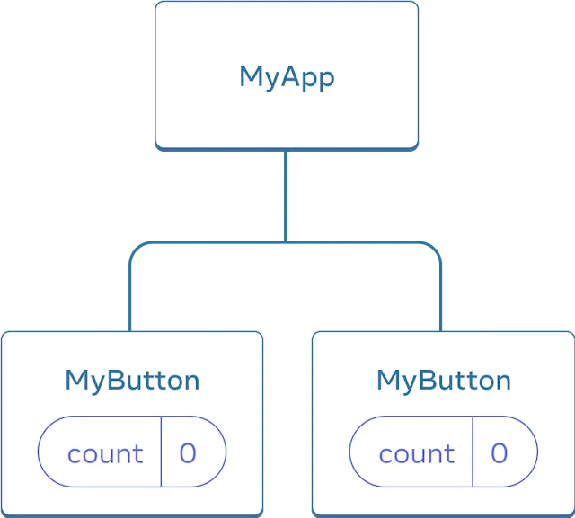

## functions

Any time you want to perform some sort of repeatable task with JavaScript, you can use a function. Let’s take a look at some of the different syntax options:

### function declarations

A function declaration or function definition starts with the `function` keyword, which is followed by the name of the function, `logCompliment`. The JavaScript statements that are part of the function are defined between the curly braces. Once you’ve declared the function, you’ll invoke or call it to see it execute:

```jsx
function letsPrint() {
  console.log('Lets print');
}
letsPrint();
```

Once invoked, you’ll see the compliment logged to the console.

### function expression

Another option is to use a function expression. This just involves creating the function as a variable:

```jsx
const letsPrint = function () {
  console.log('Lets print');
};
letsPrint();
```

One thing to be aware of when deciding between a function declaration and a function expression is that function declarations are hoisted and function expressions are not: meaning you can invoke a function before you write a function declaration. You cannot invoke a function created by a function expression.

### passing arguments

The `letsPrint` function currently takes in no arguments or parameters. We can pass named parameters to a function simply by adding them to the parentheses. Let’s start by adding a `firstName` variable:

```tsx
const letsPrint = function (firstName: string) {
  console.log(`Hello ${firstName}`);
};

letsPrint('Billy');
```

Now when we call the `letsPrint` function, the `firstName` value sent will be added to the console message. Notice how we need to provide the "type" for this variable. We could add to this a bit by creating another argument called message. Now, we won’t hard-code the message. We’ll pass in a dynamic value as a parameter:

```tsx
const letsPrint = function (firstName: string, message: string) {
  console.log(`${message} ${firstName}`);
};

letsPrint('Billy', 'Hello!');
```

### function returns

Let's have our function return stuff:

```tsx
const letsPrint = function (firstName: string, message: string) {
  return `${message} ${firstName}`;
};

console.log(letsPrint('Billy', 'Hello!'));
```

### arrow functions

Arrow functions are a useful new feature of ES6. With arrow functions, you can create functions without using the function keyword. You also often do not have to use the return keyword. Let’s consider a function that takes in a firstName and returns a string, turning the person into a soccer fan:

```tsx
const makeSoccerFan = (name: string) => `${name} is a soccer fan!`;
```

With the arrow, we now have an entire function declaration on one line. The function keyword is removed. We also remove return because the arrow points to what should be returned. We can keep this as a one-line function because there is only one statement that needs to be returned. If there are multiple lines, you’ll use curly braces. Also, you can provide the return type from that function: `: string => `

```tsx
const myFunc = (name: string): string => {
  if (name) {
    return `${name} is a soccer fan!`;
  } else {
    return 'Not a soccer fan!';
  }
};
```

### returning objects

What happens if you want to return an object? Consider a function called person that builds an object based on parameters passed in for `firstName` and `lastName`:

```tsx
// Declared type person
type Person = {
  firstName: string;
  lastName: string;
};

// ? means it is optional
const getInfo = (firstName?: string, lastName?: string): Person => {
  if (firstName && lastName) {
    return {
      firstName: firstName,
      lastName: lastName,
    };
  } else {
    return {
      firstName: 'N/A',
      lastName: 'N/A',
    };
  }
};

console.log(JSON.stringify(getInfo('James', 'Bond')));
```

## objects and arrays

Since ES2016, JavaScript syntax has supported creative ways of scoping variables within objects and arrays. These creative techniques are widely used among the React community. Let’s take a look at a few of them, including destructuring, object literal enhancement, and the spread operator.

### destructuring objects

Destructuring means picking and choosing only those fields that are of interest to you from an object. Say for example, we're passed an object of type `Person` with a person's `firstName`, `lastName` and age but we only want to display their fName and lName:

```tsx
type Person = {
  firstName: string;
  lastName: string;
  age: number;
};

const getInfo = ({ firstName, age }: Person) => {
  console.log(`You sent in: ${firstName}, ${age}`);
};

const myPerson: Person = {
  firstName: 'james',
  lastName: 'bond',
  age: 40,
};

getInfo(myPerson);
```

A new notation above:

- Typescript expects us to define the types we're extracting from the object. Thus this line:

```tsx
({ firstName, age }: Person)
```

Let’s take this one level farther to reflect a data change. Now, the regularPerson object has a new nested object on the spouse key. So our new `Person` object is now this:

```tsx
type Person = {
  firstName: string;
  lastName: string;
  age: number;
  spouse: {
    firstName: string;
    lastName: string;
  };
};

const getInfo = ({ lastName, age, spouse: { firstName } }: Person) => {
  console.log(
    `Welcome Mr. ${lastName}, 
    aged ${age} and your wife: 
    ${firstName}`
  );
};

const myPerson: Person = {
  firstName: 'james',
  lastName: 'bond',
  age: 40,
  spouse: {
    firstName: 'eva',
    lastName: 'green',
  },
};

getInfo(myPerson);
```

### destructuring arrays

Values can also be destructured from arrays. Imagine that we wanted to assign the first value of an array to a variable name:

```tsx
const [a] = ['a', 'b', 'c'];
console.log(a); // a
```

We can also pass over unnecessary values with list matching using commas. List matching occurs when commas take the place of elements that should be skipped. With the same array, we can access the last value by replacing the first two values with commas:

```tsx
const [, , c] = ['a', 'b', 'c'];
console.log(c); // c
```

### object literal enhancement

This is the opposite of destructuring: ie reconstructing the object:

```tsx
const fName = 'james';
const lName = 'bond';
const print = function () {
  console.log(`${this.fName}, ${this.lName}`);
};

const actionHero = { fName, lName, print };
actionHero.print(); // Mt. Tallac is 9738 feet tall
```

Notice we use `this` to access the object keys. Another example:

```tsx
const skier = {
  name,
  sound,
  powerYell() {
    let yell = this.sound.toUpperCase();
    console.log(`${yell} ${yell} ${yell}!!!`);
  },
  speed(mph) {
    this.speed = mph;
    console.log('speed:', mph);
  },
};
```

Object literal enhancement allows us to pull global variables into objects and reduces typing by making the function keyword unnecessary.

### spread operator

The spread operator is three dots `(...)` that perform several different tasks. First, the spread operator allows us to combine the contents of arrays. For example, if we had two arrays, we could make a third array that combines the two arrays into one:

```tsx
const one = ['a', 'b', 'c'];
const two = ['d', 'e', 'f'];
const three = [...one, ...two];
```

We can also use the three-dot syntax to collect function arguments as an array. When used in a function, these are called rest parameters. Here, we build a function that takes in n number of arguments using the spread operator, then uses those arguments to print some console messages:

```tsx
function directions(...args) {
  let [start, ...remaining] = args;
  let [finish, ...stops] = remaining.reverse();

  console.log(`drive through ${args.length} towns`);
  console.log(`start in ${start}`);
  console.log(`the destination is ${finish}`);
  console.log(`stopping ${stops.length} times in between`);
}

directions('Truckee', 'Tahoe City', 'Sunnyside', 'Homewood', 'Tahoma');
```

The directions function takes in the arguments using the spread operator. The first argument is assigned to the start variable. The last argument is assigned to a finish variable using Array.reverse. We then use the length of the arguments array to dis‐ play how many towns we’re going through. The number of stops is the length of the arguments array minus the finish stop.

The spread operator can also be used for objects:

```tsx
const morning = {
  breakfast: 'oatmeal',
  lunch: 'peanut butter and jelly',
};
const dinner = 'mac and cheese';
const backpackingMeals = { ...morning, dinner };
console.log(backpackingMeals);
// {
// breakfast: "oatmeal",
// lunch: "peanut butter and jelly",
// dinner: "mac and cheese"
// }
```

## asynchronous execution

So far, we've seen synchronous execution. Let's see how we can make async calls:

✋🚧✋ SECTIONS BELOW ARE FROM MY OLD STUDIES!

## Component

Let's create our first component:

```tsx
import React from 'react';
import './App.css';

function Button() {
  return <button>alert('You clicked me!')</button>;
}

function App() {
  return (
    <div className="App">
      <p>Learn React</p>
      <Button />
    </div>
  );
}

export default App;
```

A few things to note above:

- We have default component that's exported from this file called `App`
- We have another component called `Button`.

Notice how we use `Button` inside of `App`:

```tsx
<Button />
```

Also notice that the name of this new component needs to start with an upper case. React components are regular JavaScript functions, but their names must start with a capital letter or they won’t work!

## Event Handlers

You can respond to events by declaring event handler functions inside your components:

```tsx
function MyButton() {
  function handleClick() {
    alert('You clicked me!');
  }

  return <button onClick={handleClick}>Click me</button>;
}
```

Notice how `onClick={handleClick}` has no parentheses at the end! Do not call the event handler function: you only need to pass it down. React will call your event handler when the user clicks the button.

## State

Often, you’ll want your component to “remember” some information and display it. For example, maybe you want to count the number of times a button is clicked. To do this, add state to your component.

First, we need to import `useState` from `react`:

```tsx
import React from 'react';
import { useState } from 'react';
import './App.css';
```

Now you can declare a state variable inside your component:

```tsx
const [count, setCount] = useState(0);
```

You will get two things from `useState`: the current state (`count`), and the function that lets you update it (`setCount`). You can give them any names, but the convention is to call them like `[something, setSomething]`.

The first time the button is displayed, count will be 0 because you passed 0 to `useState()`. When you want to change state, call `setCount()` and pass the new value to it. Clicking this button will increment the counter:

```tsx
import React from 'react';
import { useState } from 'react';
import './App.css';

function Button() {
  const [count, setCount] = useState(0);
  function handleClick() {
    setCount(count + 1);
  }
  return <button onClick={handleClick}>'You clicked me: {count} times </button>;
}

function App() {
  return (
    <div className="App">
      <p>Learn React</p>
      <Button />
    </div>
  );
}

export default App;
```

Let's look at the update `Button` component:

```tsx
function Button() {
  const [count, setCount] = useState(0);
  function handleClick() {
    setCount(count + 1);
  }
  return <button onClick={handleClick}>'You clicked me: {count} times </button>;
}
```

- notice the `const` keyword while using the state
- notice there's another function called `handleClick` inside of `Button`.
- notice that we don't do this: `count = count + 1`, we just tell what to do with `count` and let `setCount` do the rest: `setCount(count + 1)`.

You can use the `Button` component as many times as you want and each `Button` will come with its own counter:

```tsx
import { useState } from 'react';
import React from 'react';
import './App.css';

function Button() {
  const [count, setCount] = useState(0);
  function handleClick() {
    setCount(count + 1);
  }

  return <button onClick={handleClick}> You clicked me {count} times! </button>;
}

function App() {
  return (
    <div className="App">
      <p>Learn React</p>
      <Button />
      <Button />
    </div>
  );
}

export default App;
```

Each button “remembers” its own count state and doesn’t affect other buttons.

## Hooks

Functions starting with `use` are called `Hooks`. `useState` is a built-in Hook provided by React. You can find other built-in Hooks in the [React API reference](https://beta.reactjs.org/reference/react). You can also write your own Hooks by combining the existing ones.

Hooks are more restrictive than regular functions. You can only call Hooks at the top level of your components (or other Hooks). If you want to use useState in a condition or a loop, extract a new component and put it there.

In the previous example, each `Button` had its own independent count, and when each button was clicked, only the count for the button clicked changed:



However, often you’ll need components to share data and always update together.

To make both `Button` components display the same count and update together, you need to move the state from the individual buttons “upwards” to the closest component containing all of them. In our example, this closest component is `App`:


Now when you click either button, the count in `App` will change, which will change both of the counts in `Button`. Here’s how you can express this in code.

1. Here is what we had:

```tsx
import { useState } from 'react';
import React from 'react';
import './App.css';

function Button() {
  const [count, setCount] = useState(0);
  function handleClick() {
    setCount(count + 1);
  }

  return <button onClick={handleClick}> You clicked me {count} times! </button>;
}

function App() {
  return (
    <div className="App">
      <p>Learn React</p>
      <Button />
      <Button />
    </div>
  );
}

export default App;
```

2. We need to move the state "up" to `App`:

```tsx
function Button() {
  return <button onClick={handleClick}> You clicked me {count} times! </button>;
}

function App() {
  const [count, setCount] = useState(0);
  function handleClick() {
    setCount(count + 1);
  }

  return (
    <div className="App">
      <p>Learn React</p>
      <Button />
      <Button />
    </div>
  );
}

export default App;
```

3. Next, we need to pass the `count` and `setCount` state variables to the `Button` component. This is done just like how you'd pass a variable to a component. You also need to change the signature for `Button` component to accept `count` and `setCount`. The information you pass down like this is called `props`. `App` component contains the `count` state and the `handleClick` event handler, and passes both of them down as props to each of the buttons.

```tsx
function Button({ count, onClick }: any) {
  return <button onClick={onClick}> You clicked me {count} times! </button>;
}

function App() {
  const [count, setCount] = useState(0);
  function handleClick() {
    setCount(count + 1);
  }

  return (
    <div className="App">
      <p>Learn React</p>
      <Button count={count} onClick={handleClick} />
      <Button count={count} onClick={handleClick} />
    </div>
  );
}

export default App;
```

Let's look at the `Button` component:

```tsx
function Button({ count, onClick }: any) {
  return <button onClick={onClick}> You clicked me {count} times! </button>;
}
```

- it is accepting variables: `{count, onClick}` of type `any`
- the button onClick calls the function passed in which is also called `onClick`.
- value of `count` is displayed as text in the button

From `App`:

```tsx
function App() {
  const [count, setCount] = useState(0);
  function handleClick() {
    setCount(count + 1);
  }

  return (
    <div className="App">
      <p>Learn React</p>
      <Button count={count} onClick={handleClick} />
      <Button count={count} onClick={handleClick} />
    </div>
  );
}
```

- We initialize the state like before using `useState` and declare a `handleClick` function that updates the state
- We call `Button` with the state value and state updater function

When you click the button, the `onClick` handler fires. Each button’s `onClick` prop was set to the `handleClick` function inside `App`, so the code inside of it runs. That code calls `setCount(count + 1)`, incrementing the `count` state variable. The new count value is passed as a prop to each button, so they all show the new value.

This is called “lifting state up”. By moving state up, we’ve shared it between components.

With the above in place, your buttons will both reflect the updated value as you click on any button. I made mine a little fun where we start off from 10 and each click reduces the number. While the number > 0, we're healthy and at 0, we alert happy new year! `App` component stays the same:

```tsx
function Button({ count, onClick }: any) {
  return (
    <button onClick={onClick}>
      Remaining: {count > 0 ? count : '0'} {count > 0 ? 'old year' : 'happy new year!'}
    </button>
  );
}

function App() {
  const [count, setCount] = useState(10);

  function handleClick() {
    setCount(count - 1);
  }

  return (
    <div className="App">
      <p>Learn React</p>
      <Button count={count} onClick={handleClick} />
      <Button count={count} onClick={handleClick} />
    </div>
  );
}
```
